# NexusOps — Entity Relationship Diagram

**Version:** 1.9  
**Date:** April 3, 2026  
**Status:** Active  
**Author:** Platform Engineering Team  
**Source:** `packages/db/src/schema/` (32 schema files, 107 tables, Drizzle ORM / PostgreSQL 16)

---

## Changelog

| Version | Date | Summary |
|---------|------|---------|
| **1.9** | 2026-04-03 | **DB performance indexes added.** 4 covering indexes applied on production: `tickets_org_sla_breached_idx` (partial, `sla_breached = true`), `tickets_org_created_idx` (`org_id, created_at DESC`), `tickets_org_resolved_idx` (partial, `resolved_at IS NOT NULL`), `tickets_org_status_covering_idx` (`org_id, status_id, created_at DESC`). Resolves `executiveOverview` 8,010ms timeout for `hr_manager` (INFRA-1). Drizzle operator exports consolidated — duplicate re-exports removed from `packages/db/src/index.ts`; single source now `schema/index.ts`. |
| **1.8** | 2026-04-03 | **JOIN patterns expanded.** `tickets` LEFT JOINs `users` (on `assignee_id`) in `tickets.list` to surface `assignee_name` and `assignee_email` — no new table, new query pattern. `ticket_priorities` LEFT JOINs `tickets` in `reports.slaDashboard` to return `priority_name` and `priority_color` per breach group. `survey_responses.score` aggregated (AVG) in `reports.executiveOverview` to compute live CSAT score. `hr_cases.notes` field used as append-only resolution log by `hr.cases.resolve` mutation (no schema change). `grc.audit_plans`, `grc.policies`, `grc.risks` now all queried by the Security page Config Compliance tab (read-only cross-domain reference). |
| **1.7** | 2026-04-03 | Schema count updated: 32 schema files, 107 tables. `ticketWatchers` table confirmed in use via `tickets.toggleWatch` mutation (LEFT JOIN pattern). `org_counters` table documented as sequence-reset target (wiped on clean-slate operation). `sessions` table: all rows cleared on `changePassword` + Redis `invalidateSessionCache` called per session. Production state: all 83 transactional tables at 0 rows; 24 config/reference tables populated. |
| 1.6 | 2026-04-02 | Added `ticket_comments` LEFT JOIN `users` for author resolution. Added bcrypt semaphore and idempotency index on `tickets`. |
| 1.5 | 2026-03-27 | Schema aligned with stress test findings: `ticket_priorities`, `ticket_categories` confirmed stable. |
| 1.0–1.4 | 2026-03 | Full 16-domain ERD: Auth, ITSM, Assets, Workflows, HR, Procurement, Change/Problem/Release, Security, GRC, Contracts, Projects, CRM, KB, Approvals, Notifications, Facilities. |

---

## Table of Contents

1. [Introduction](#1-introduction)
2. [ERD Notation & Legend](#2-erd-notation--legend)
3. [Domain 1 — Core: Auth, Identity & Organisation](#3-domain-1--core-auth-identity--organisation)
4. [Domain 2 — ITSM: Ticketing](#4-domain-2--itsm-ticketing)
5. [Domain 3 — Assets & CMDB](#5-domain-3--assets--cmdb)
6. [Domain 4 — Workflows](#6-domain-4--workflows)
7. [Domain 5 — HR & People](#7-domain-5--hr--people)
8. [Domain 6 — Procurement & Finance](#8-domain-6--procurement--finance)
9. [Domain 7 — Change, Problem & Release Management](#9-domain-7--change-problem--release-management)
10. [Domain 8 — Security](#10-domain-8--security)
11. [Domain 9 — GRC: Governance, Risk & Compliance](#11-domain-9--grc-governance-risk--compliance)
12. [Domain 10 — Contracts & Legal](#12-domain-10--contracts--legal)
13. [Domain 11 — Projects](#13-domain-11--projects)
14. [Domain 12 — CRM: Customer Relationship Management](#14-domain-12--crm-customer-relationship-management)
15. [Domain 13 — Knowledge Base & Portal](#15-domain-13--knowledge-base--portal)
16. [Domain 14 — Approvals](#16-domain-14--approvals)
17. [Domain 15 — Notifications](#17-domain-15--notifications)
18. [Domain 16 — Facilities & Workplace](#18-domain-16--facilities--workplace)
19. [Domain 17 — DevOps & Deployments](#19-domain-17--devops--deployments)
20. [Domain 18 — Surveys](#20-domain-18--surveys)
21. [Domain 19 — Walk-Up Service Desk](#21-domain-19--walk-up-service-desk)
22. [Domain 20 — Application Portfolio Management (APM)](#22-domain-20--application-portfolio-management-apm)
23. [Domain 21 — On-Call Management](#23-domain-21--on-call-management)
24. [Domain 22 — Service Catalog](#24-domain-22--service-catalog)
25. [Domain 23 — Integrations & Webhooks](#25-domain-23--integrations--webhooks)
26. [Domain 24 — Work Orders](#26-domain-24--work-orders)
27. [Cross-Domain Relationship Map](#27-cross-domain-relationship-map)
28. [Complete Table Reference](#28-complete-table-reference)
29. [PostgreSQL Enum Reference](#29-postgresql-enum-reference)
30. [Schema Design Notes & Known Gaps](#30-schema-design-notes--known-gaps)

> **v1.1 Update** — India Compliance: `tickets` (impact/urgency/SLA pause), `employees` (PAN/Aadhaar/UAN/tax_regime), `vendors` (GSTIN/PAN/TDS/MSME), `invoices` (full GST line items), `risks` (residual scoring), + new tables: `salary_structures`, `payroll_runs`, `payslips`, `goods_receipt_notes`, `grn_line_items`, `invoice_line_items`, `risk_controls`, `audit_findings`, and Domain 25 (`compliance_calendar_items`, `directors`, `portal_users`, `tds_challan_records`, `epfo_ecr_submissions`).

> **v1.2 Update** — Added Domain 26 — Inventory Management: new `inventory.ts` schema file with `inventory_items` and `inventory_transactions` tables. Updated total schema file count from 29 to 31 (includes `india-compliance.ts` added in v1.1 and `inventory.ts` in v1.2). Total tables now ~85+.

> **v1.4 Update** — `assignment_rules` table deployed: rebuilt `@nexusops/db` and ran `pnpm db:push` to create the table. `ticket_statuses.category = 'open'` pre-condition validated by k6 chaos flow (1,124/1,124 create calls succeed once statuses are seeded). Optimistic locking on `tickets.version` stress-tested: 2,004 clean HTTP 409 conflicts under 20 concurrent writers, 0 data corruptions. See `NexusOps_K6_Security_and_Load_Test_Report_2026.md`.

---

## 1. Introduction

This document provides the complete Entity Relationship Diagram for the NexusOps database. The schema is implemented using **Drizzle ORM** targeting **PostgreSQL 16** and is defined across **31 schema files** under `packages/db/src/schema/`.

The schema is organised into **26 bounded domains**. Each domain section contains:
- A **Mermaid ERD diagram** for that domain's tables and their relationships
- A **note on cross-domain links** (FK references to tables in other domains)

Following the domain diagrams is a **complete table reference** listing every column for every table, and a **PostgreSQL enum reference**.

**Statistics:**
- Total tables: ~85+
- Total enum types: 84
- Total schema files: 31
- Central anchor table: `organizations` (nearly every table has `org_id` FK)

---

## 2. ERD Notation & Legend

Diagrams use [Mermaid `erDiagram`](https://mermaid.js.org/syntax/entityRelationshipDiagram.html) syntax.

### Relationship Cardinality

| Notation | Meaning |
|----------|---------|
| `||--||` | Exactly one to exactly one |
| `||--o{` | One to zero-or-many |
| `||--|{` | One to one-or-many |
| `}o--o{` | Zero-or-many to zero-or-many |
| `}|--|{` | One-or-many to one-or-many |

### Column Key Markers

| Marker | Meaning |
|--------|---------|
| `PK` | Primary Key |
| `FK` | Foreign Key |
| `UK` | Unique Key / unique constraint |
| `PK,FK` | Part of a composite primary key that is also a FK |

### Column Type Abbreviations

| Abbreviation | PostgreSQL Type |
|-------------|----------------|
| `uuid` | UUID |
| `text` | TEXT |
| `int` | INTEGER |
| `bigint` | BIGINT |
| `bool` | BOOLEAN |
| `numeric` | NUMERIC(p,s) |
| `timestamptz` | TIMESTAMP WITH TIME ZONE |
| `jsonb` | JSONB |
| `text[]` | TEXT ARRAY |
| `enum(...)` | PostgreSQL `pgEnum` |

---

## 3. Domain 1 — Core: Auth, Identity & Organisation

This domain is the root anchor of the entire schema. Almost every other table references `organizations` and `users`.

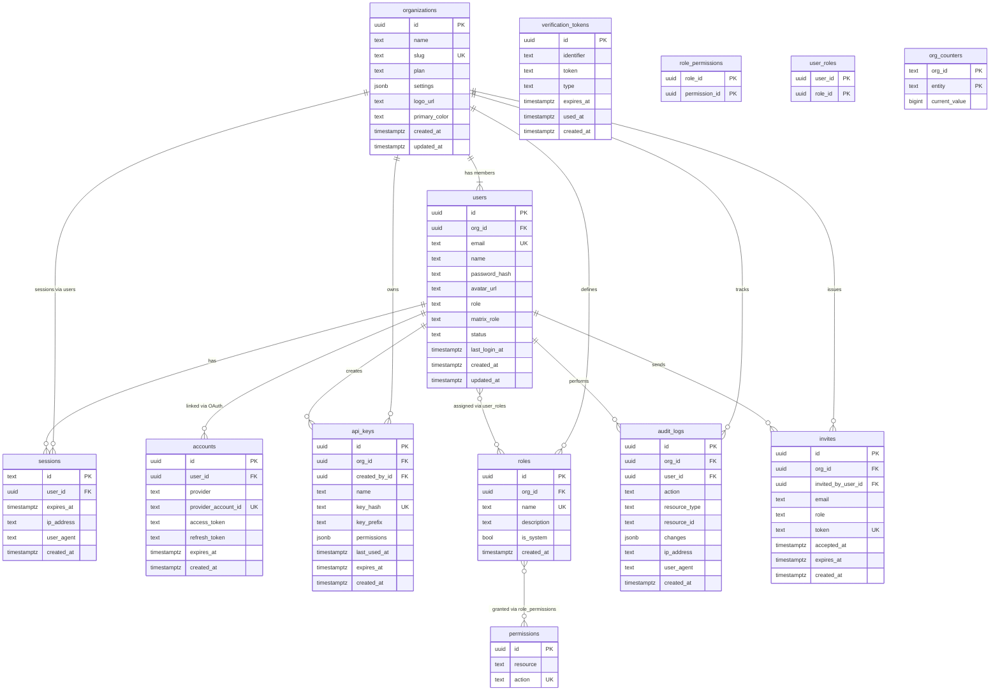
```mermaid
erDiagram
    organizations {
        uuid id PK
        text name
        text slug UK
        text plan
        jsonb settings
        text logo_url
        text primary_color
        timestamptz created_at
        timestamptz updated_at
    }

    users {
        uuid id PK
        uuid org_id FK
        text email UK
        text name
        text password_hash
        text avatar_url
        text role
        text matrix_role
        text status
        timestamptz last_login_at
        timestamptz created_at
        timestamptz updated_at
    }

    sessions {
        text id PK
        uuid user_id FK
        timestamptz expires_at
        text ip_address
        text user_agent
        timestamptz created_at
    }

    accounts {
        uuid id PK
        uuid user_id FK
        text provider
        text provider_account_id UK
        text access_token
        text refresh_token
        timestamptz expires_at
        timestamptz created_at
    }

    verification_tokens {
        uuid id PK
        text identifier
        text token
        text type
        timestamptz expires_at
        timestamptz used_at
        timestamptz created_at
    }

    api_keys {
        uuid id PK
        uuid org_id FK
        uuid created_by_id FK
        text name
        text key_hash UK
        text key_prefix
        jsonb permissions
        timestamptz last_used_at
        timestamptz expires_at
        timestamptz created_at
    }

    roles {
        uuid id PK
        uuid org_id FK
        text name UK
        text description
        bool is_system
        timestamptz created_at
    }

    permissions {
        uuid id PK
        text resource
        text action UK
    }

    role_permissions {
        uuid role_id PK
        uuid permission_id PK
    }

    user_roles {
        uuid user_id PK
        uuid role_id PK
    }

    audit_logs {
        uuid id PK
        uuid org_id FK
        uuid user_id FK
        text action
        text resource_type
        text resource_id
        jsonb changes
        text ip_address
        text user_agent
        timestamptz created_at
    }

    invites {
        uuid id PK
        uuid org_id FK
        uuid invited_by_user_id FK
        text email
        text role
        text token UK
        timestamptz accepted_at
        timestamptz expires_at
        timestamptz created_at
    }

    org_counters {
        text org_id PK
        text entity PK
        bigint current_value
    }

    organizations ||--|{ users : "has members"
    organizations ||--o{ sessions : "sessions via users"
    organizations ||--o{ api_keys : "owns"
    organizations ||--o{ roles : "defines"
    organizations ||--o{ audit_logs : "tracks"
    organizations ||--o{ invites : "issues"
    users ||--o{ sessions : "has"
    users ||--o{ accounts : "linked via OAuth"
    users ||--o{ api_keys : "creates"
    users ||--o{ audit_logs : "performs"
    users ||--o{ invites : "sends"
    users }o--o{ roles : "assigned via user_roles"
    roles }o--o{ permissions : "granted via role_permissions"
```

---

## 4. Domain 2 — ITSM: Ticketing

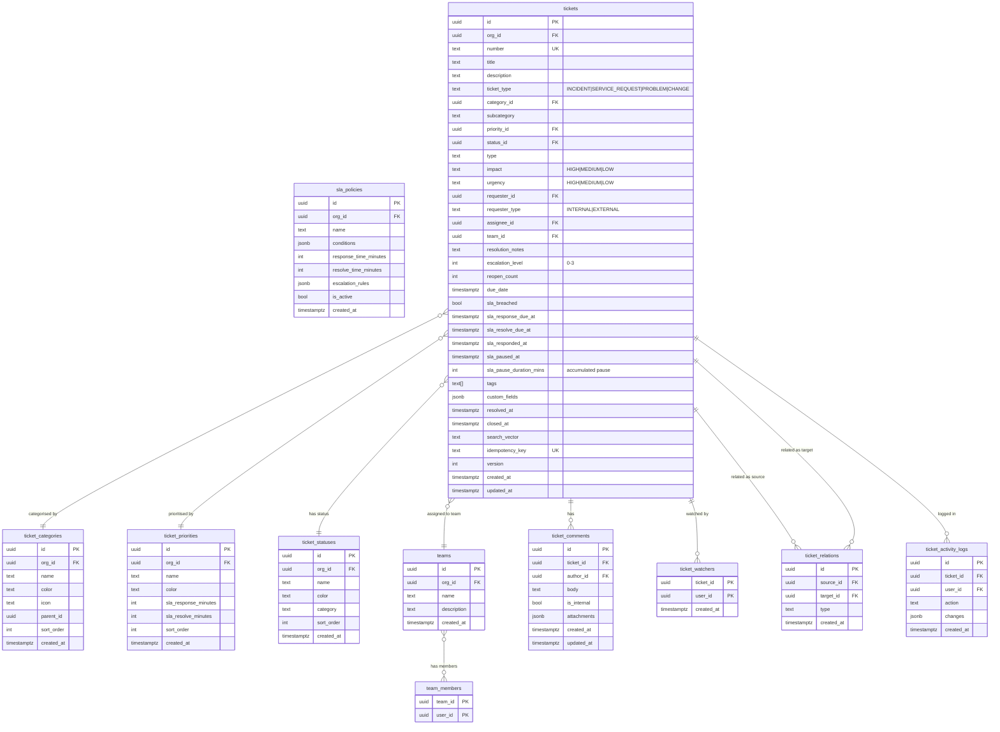
```mermaid
erDiagram
    ticket_categories {
        uuid id PK
        uuid org_id FK
        text name
        text color
        text icon
        uuid parent_id
        int sort_order
        timestamptz created_at
    }

    ticket_priorities {
        uuid id PK
        uuid org_id FK
        text name
        text color
        int sla_response_minutes
        int sla_resolve_minutes
        int sort_order
        timestamptz created_at
    }

    ticket_statuses {
        uuid id PK
        uuid org_id FK
        text name
        text color
        text category
        int sort_order
        timestamptz created_at
    }

    sla_policies {
        uuid id PK
        uuid org_id FK
        text name
        jsonb conditions
        int response_time_minutes
        int resolve_time_minutes
        jsonb escalation_rules
        bool is_active
        timestamptz created_at
    }

    teams {
        uuid id PK
        uuid org_id FK
        text name
        text description
        timestamptz created_at
    }

    team_members {
        uuid team_id PK
        uuid user_id PK
    }

    tickets {
        uuid id PK
        uuid org_id FK
        text number UK
        text title
        text description
        text ticket_type "INCIDENT|SERVICE_REQUEST|PROBLEM|CHANGE"
        uuid category_id FK
        text subcategory
        uuid priority_id FK
        uuid status_id FK
        text type
        text impact "HIGH|MEDIUM|LOW"
        text urgency "HIGH|MEDIUM|LOW"
        uuid requester_id FK
        text requester_type "INTERNAL|EXTERNAL"
        uuid assignee_id FK
        uuid team_id FK
        text resolution_notes
        int escalation_level "0-3"
        int reopen_count
        timestamptz due_date
        bool sla_breached
        timestamptz sla_response_due_at
        timestamptz sla_resolve_due_at
        timestamptz sla_responded_at
        timestamptz sla_paused_at
        int sla_pause_duration_mins "accumulated pause"
        text[] tags
        jsonb custom_fields
        timestamptz resolved_at
        timestamptz closed_at
        text search_vector
        text idempotency_key UK
        int version
        timestamptz created_at
        timestamptz updated_at
    }

    ticket_comments {
        uuid id PK
        uuid ticket_id FK
        uuid author_id FK
        text body
        bool is_internal
        jsonb attachments
        timestamptz created_at
        timestamptz updated_at
    }

    ticket_watchers {
        uuid ticket_id PK
        uuid user_id PK
        timestamptz created_at
    }

    ticket_relations {
        uuid id PK
        uuid source_id FK
        uuid target_id FK
        text type
        timestamptz created_at
    }

    ticket_activity_logs {
        uuid id PK
        uuid ticket_id FK
        uuid user_id FK
        text action
        jsonb changes
        timestamptz created_at
    }

    tickets ||--o{ ticket_comments : "has"
    tickets ||--o{ ticket_watchers : "watched by"
    tickets ||--o{ ticket_relations : "related as source"
    tickets ||--o{ ticket_relations : "related as target"
    tickets ||--o{ ticket_activity_logs : "logged in"
    tickets }o--|| ticket_categories : "categorised by"
    tickets }o--|| ticket_priorities : "prioritised by"
    tickets }o--|| ticket_statuses : "has status"
    tickets }o--|| teams : "assigned to team"
    teams }o--o{ team_members : "has members"
```

---

## 5. Domain 3 — Assets & CMDB

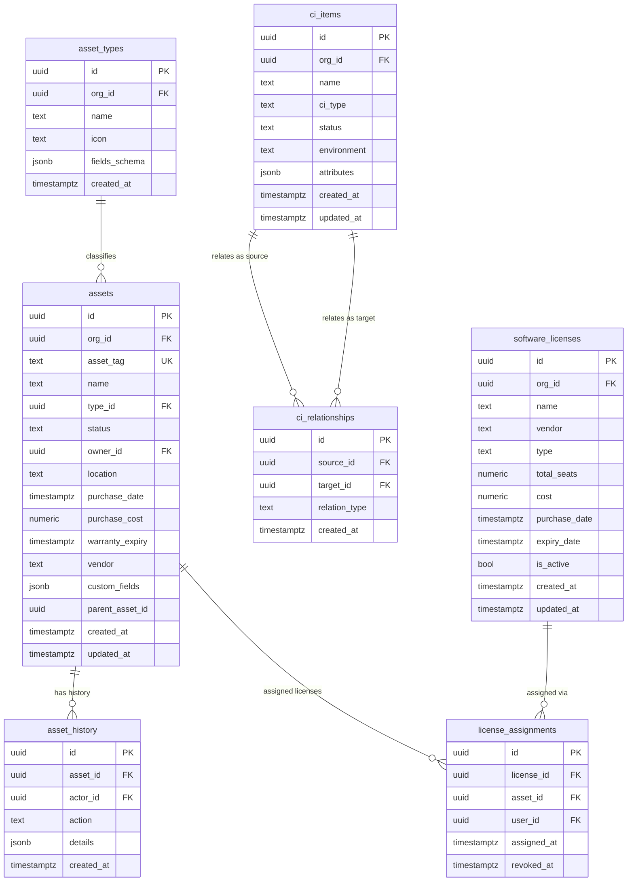
```mermaid
erDiagram
    asset_types {
        uuid id PK
        uuid org_id FK
        text name
        text icon
        jsonb fields_schema
        timestamptz created_at
    }

    assets {
        uuid id PK
        uuid org_id FK
        text asset_tag UK
        text name
        uuid type_id FK
        text status
        uuid owner_id FK
        text location
        timestamptz purchase_date
        numeric purchase_cost
        timestamptz warranty_expiry
        text vendor
        jsonb custom_fields
        uuid parent_asset_id
        timestamptz created_at
        timestamptz updated_at
    }

    asset_history {
        uuid id PK
        uuid asset_id FK
        uuid actor_id FK
        text action
        jsonb details
        timestamptz created_at
    }

    ci_items {
        uuid id PK
        uuid org_id FK
        text name
        text ci_type
        text status
        text environment
        jsonb attributes
        timestamptz created_at
        timestamptz updated_at
    }

    ci_relationships {
        uuid id PK
        uuid source_id FK
        uuid target_id FK
        text relation_type
        timestamptz created_at
    }

    software_licenses {
        uuid id PK
        uuid org_id FK
        text name
        text vendor
        text type
        numeric total_seats
        numeric cost
        timestamptz purchase_date
        timestamptz expiry_date
        bool is_active
        timestamptz created_at
        timestamptz updated_at
    }

    license_assignments {
        uuid id PK
        uuid license_id FK
        uuid asset_id FK
        uuid user_id FK
        timestamptz assigned_at
        timestamptz revoked_at
    }

    asset_types ||--o{ assets : "classifies"
    assets ||--o{ asset_history : "has history"
    assets ||--o{ license_assignments : "assigned licenses"
    software_licenses ||--o{ license_assignments : "assigned via"
    ci_items ||--o{ ci_relationships : "relates as source"
    ci_items ||--o{ ci_relationships : "relates as target"
```

---

## 6. Domain 4 — Workflows

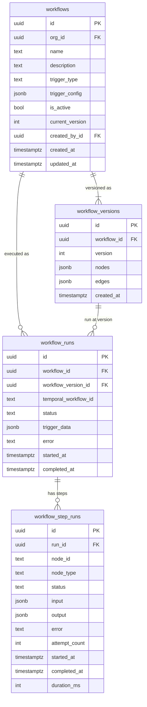
```mermaid
erDiagram
    workflows {
        uuid id PK
        uuid org_id FK
        text name
        text description
        text trigger_type
        jsonb trigger_config
        bool is_active
        int current_version
        uuid created_by_id FK
        timestamptz created_at
        timestamptz updated_at
    }

    workflow_versions {
        uuid id PK
        uuid workflow_id FK
        int version
        jsonb nodes
        jsonb edges
        timestamptz created_at
    }

    workflow_runs {
        uuid id PK
        uuid workflow_id FK
        uuid workflow_version_id FK
        text temporal_workflow_id
        text status
        jsonb trigger_data
        text error
        timestamptz started_at
        timestamptz completed_at
    }

    workflow_step_runs {
        uuid id PK
        uuid run_id FK
        text node_id
        text node_type
        text status
        jsonb input
        jsonb output
        text error
        int attempt_count
        timestamptz started_at
        timestamptz completed_at
        int duration_ms
    }

    workflows ||--|{ workflow_versions : "versioned as"
    workflows ||--o{ workflow_runs : "executed as"
    workflow_versions ||--o{ workflow_runs : "run at version"
    workflow_runs ||--o{ workflow_step_runs : "has steps"
```

---

## 7. Domain 5 — HR & People

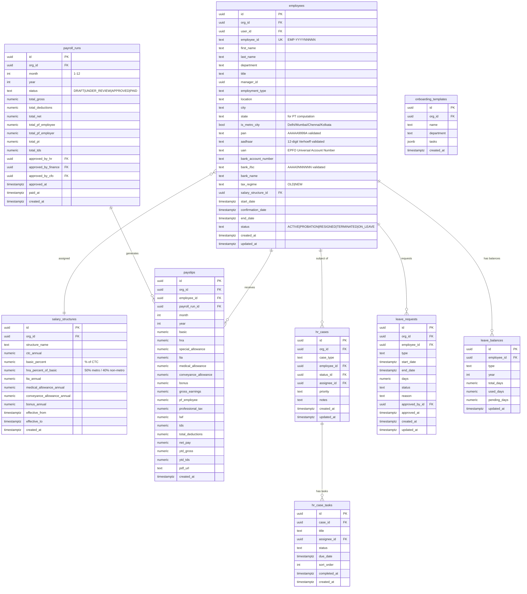
```mermaid
erDiagram
    employees {
        uuid id PK
        uuid org_id FK
        uuid user_id FK
        text employee_id UK "EMP-YYYYNNNNN"
        text first_name
        text last_name
        text department
        text title
        uuid manager_id
        text employment_type
        text location
        text city
        text state "for PT computation"
        bool is_metro_city "Delhi/Mumbai/Chennai/Kolkata"
        text pan "AAAAA9999A validated"
        text aadhaar "12-digit Verhoeff validated"
        text uan "EPFO Universal Account Number"
        text bank_account_number
        text bank_ifsc "AAAA0NNNNNN validated"
        text bank_name
        text tax_regime "OLD|NEW"
        uuid salary_structure_id FK
        timestamptz start_date
        timestamptz confirmation_date
        timestamptz end_date
        text status "ACTIVE|PROBATION|RESIGNED|TERMINATED|ON_LEAVE"
        timestamptz created_at
        timestamptz updated_at
    }

    salary_structures {
        uuid id PK
        uuid org_id FK
        text structure_name
        numeric ctc_annual
        numeric basic_percent "% of CTC"
        numeric hra_percent_of_basic "50% metro / 40% non-metro"
        numeric lta_annual
        numeric medical_allowance_annual
        numeric conveyance_allowance_annual
        numeric bonus_annual
        timestamptz effective_from
        timestamptz effective_to
        timestamptz created_at
    }

    payroll_runs {
        uuid id PK
        uuid org_id FK
        int month "1-12"
        int year
        text status "DRAFT|UNDER_REVIEW|APPROVED|PAID"
        numeric total_gross
        numeric total_deductions
        numeric total_net
        numeric total_pf_employee
        numeric total_pf_employer
        numeric total_pt
        numeric total_tds
        uuid approved_by_hr FK
        uuid approved_by_finance FK
        uuid approved_by_cfo FK
        timestamptz approved_at
        timestamptz paid_at
        timestamptz created_at
    }

    payslips {
        uuid id PK
        uuid org_id FK
        uuid employee_id FK
        uuid payroll_run_id FK
        int month
        int year
        numeric basic
        numeric hra
        numeric special_allowance
        numeric lta
        numeric medical_allowance
        numeric conveyance_allowance
        numeric bonus
        numeric gross_earnings
        numeric pf_employee
        numeric professional_tax
        numeric lwf
        numeric tds
        numeric total_deductions
        numeric net_pay
        numeric ytd_gross
        numeric ytd_tds
        text pdf_url
        timestamptz created_at
    }

    hr_cases {
        uuid id PK
        uuid org_id FK
        text case_type
        uuid employee_id FK
        uuid status_id FK
        uuid assignee_id FK
        text priority
        text notes
        timestamptz created_at
        timestamptz updated_at
    }

    hr_case_tasks {
        uuid id PK
        uuid case_id FK
        text title
        uuid assignee_id FK
        text status
        timestamptz due_date
        int sort_order
        timestamptz completed_at
        timestamptz created_at
    }

    onboarding_templates {
        uuid id PK
        uuid org_id FK
        text name
        text department
        jsonb tasks
        timestamptz created_at
    }

    leave_requests {
        uuid id PK
        uuid org_id FK
        uuid employee_id FK
        text type
        timestamptz start_date
        timestamptz end_date
        numeric days
        text status
        text reason
        uuid approved_by_id FK
        timestamptz approved_at
        timestamptz created_at
        timestamptz updated_at
    }

    leave_balances {
        uuid id PK
        uuid employee_id FK
        text type
        int year
        numeric total_days
        numeric used_days
        numeric pending_days
        timestamptz updated_at
    }

    employees ||--o{ hr_cases : "subject of"
    employees ||--o{ leave_requests : "requests"
    employees ||--o{ leave_balances : "has balances"
    employees ||--o{ payslips : "receives"
    employees }o--|| salary_structures : "assigned"
    payroll_runs ||--o{ payslips : "generates"
    hr_cases ||--o{ hr_case_tasks : "has tasks"
```

---

## 8. Domain 6 — Procurement & Finance

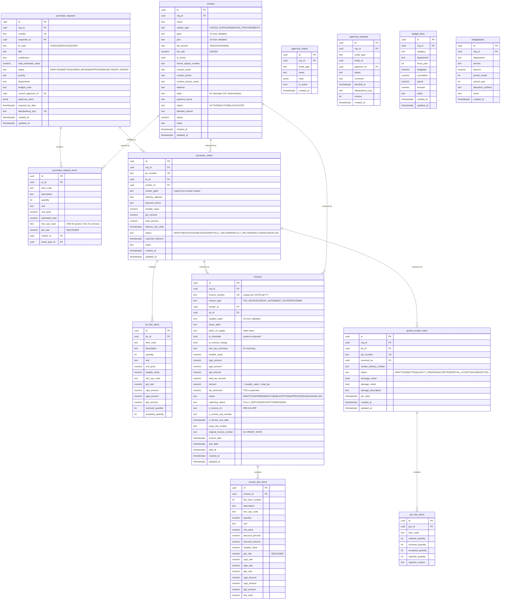
```mermaid
erDiagram
    vendors {
        uuid id PK
        uuid org_id FK
        text name
        text vendor_type "GOODS_SUPPLIER|SERVICE_PROVIDER|BOTH"
        text gstin "15-char validated"
        text pan "10-char validated"
        text tds_section "194C|194J|194I|NIL"
        numeric tds_rate "1|2|10|0"
        bool is_msme
        text msme_udyam_number
        text contact_email
        text contact_phone
        text contact_person_name
        text address
        text state "for interstate GST determination"
        text payment_terms
        text status "ACTIVE|INACTIVE|BLACKLISTED"
        text blacklist_reason
        numeric rating
        text notes
        timestamptz created_at
        timestamptz updated_at
    }

    purchase_requests {
        uuid id PK
        uuid org_id FK
        text number UK
        uuid requester_id FK
        text pr_type "GOODS|SERVICES|ASSET"
        text title
        text justification
        numeric total_estimated_value
        text status "DRAFT|SUBMITTED|UNDER_REVIEW|APPROVED|REJECTED|PO_RAISED"
        text priority
        text department
        text budget_code
        uuid current_approver_id FK
        jsonb approval_chain
        timestamptz required_by_date
        text idempotency_key UK
        timestamptz created_at
        timestamptz updated_at
    }

    purchase_request_items {
        uuid id PK
        uuid pr_id FK
        text item_code
        text description
        int quantity
        text unit
        numeric unit_price
        numeric estimated_total
        text hsn_sac_code "HSN for goods / SAC for services"
        numeric gst_rate "0|5|12|18|28"
        uuid vendor_id FK
        uuid asset_type_id FK
    }

    purchase_orders {
        uuid id PK
        uuid org_id FK
        text po_number UK
        uuid pr_id FK
        uuid vendor_id FK
        text vendor_gstin "copied from vendor master"
        text delivery_address
        text payment_terms
        numeric taxable_value
        numeric gst_amount
        numeric total_amount
        timestamptz delivery_due_date
        text status "DRAFT|SENT|ACKNOWLEDGED|PARTIALLY_DELIVERED|FULLY_DELIVERED|CLOSED|CANCELLED"
        timestamptz expected_delivery
        text notes
        timestamptz created_at
        timestamptz updated_at
    }

    po_line_items {
        uuid id PK
        uuid po_id FK
        text item_code
        text description
        int quantity
        text unit
        numeric unit_price
        numeric taxable_value
        text hsn_sac_code
        numeric gst_rate
        numeric cgst_amount
        numeric sgst_amount
        numeric igst_amount
        int received_quantity
        int accepted_quantity
    }

    goods_receipt_notes {
        uuid id PK
        uuid org_id FK
        uuid po_id FK
        text grn_number UK
        uuid received_by FK
        text vendor_delivery_challan
        text status "DRAFT|SUBMITTED|QUALITY_PENDING|ACCEPTED|PARTIAL_ACCEPTANCE|REJECTED"
        bool shortage_noted
        bool damage_noted
        text damage_description
        timestamptz grn_date
        timestamptz created_at
        timestamptz updated_at
    }

    grn_line_items {
        uuid id PK
        uuid grn_id FK
        text item_code
        int ordered_quantity
        int received_quantity
        int accepted_quantity
        int rejected_quantity
        text rejection_reason
    }

    invoices {
        uuid id PK
        uuid org_id FK
        text invoice_number UK "unique per GSTIN per FY"
        text invoice_type "TAX_INVOICE|CREDIT_NOTE|DEBIT_NOTE|PROFORMA"
        uuid vendor_id FK
        uuid po_id FK
        text supplier_gstin "15-char validated"
        text buyer_gstin
        text place_of_supply "state name"
        bool is_interstate "system-computed"
        bool is_reverse_charge
        text hsn_sac_summary "for reporting"
        numeric taxable_value
        numeric cgst_amount
        numeric sgst_amount
        numeric igst_amount
        numeric total_tax_amount
        numeric amount "= taxable_value + total_tax"
        numeric tds_deducted "TDS at payment"
        text status "DRAFT|CONFIRMED|MATCHED|EXCEPTION|APPROVED|PAID|CANCELLED"
        text matching_status "FULLY_MATCHED|EXCEPTION|PENDING"
        text e_invoice_irn "IRN from IRP"
        text e_invoice_ack_number
        timestamptz e_invoice_ack_date
        text eway_bill_number
        text original_invoice_number "for CREDIT_NOTE"
        timestamptz invoice_date
        timestamptz due_date
        timestamptz paid_at
        timestamptz created_at
        timestamptz updated_at
    }

    invoice_line_items {
        uuid id PK
        uuid invoice_id FK
        int line_item_number
        text description
        text hsn_sac_code
        numeric quantity
        text unit
        numeric unit_price
        numeric discount_percent
        numeric discount_amount
        numeric taxable_value
        numeric gst_rate "0|5|12|18|28"
        numeric cgst_rate
        numeric sgst_rate
        numeric igst_rate
        numeric cgst_amount
        numeric sgst_amount
        numeric igst_amount
        numeric line_total
    }

    approval_chains {
        uuid id PK
        uuid org_id FK
        text entity_type
        text name
        jsonb rules
        bool is_active
        timestamptz created_at
    }

    approval_requests {
        uuid id PK
        uuid org_id FK
        text entity_type
        uuid entity_id
        uuid approver_id FK
        text status
        text comment
        timestamptz decided_at
        text idempotency_key
        int version
        timestamptz created_at
    }

    budget_lines {
        uuid id PK
        uuid org_id FK
        text category
        text department
        int fiscal_year
        numeric budgeted
        numeric committed
        numeric actual
        numeric forecast
        text notes
        timestamptz created_at
        timestamptz updated_at
    }

    chargebacks {
        uuid id PK
        uuid org_id FK
        text department
        text service
        numeric amount
        int period_month
        int period_year
        text allocation_method
        text notes
        timestamptz created_at
    }

    vendors ||--o{ purchase_request_items : "quoted on"
    vendors ||--o{ purchase_orders : "ordered from"
    vendors ||--o{ invoices : "invoiced by"
    purchase_requests ||--o{ purchase_request_items : "contains"
    purchase_requests ||--o{ purchase_orders : "fulfilled by"
    purchase_orders ||--o{ po_line_items : "contains"
    purchase_orders ||--o{ invoices : "invoiced as"
    purchase_orders ||--o{ goods_receipt_notes : "received via"
    goods_receipt_notes ||--o{ grn_line_items : "contains"
    invoices ||--o{ invoice_line_items : "contains"
```

---

## 9. Domain 7 — Change, Problem & Release Management

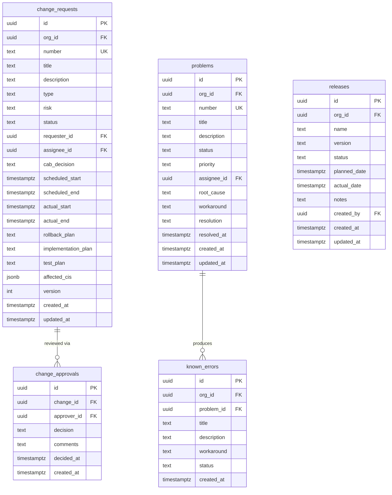
```mermaid
erDiagram
    change_requests {
        uuid id PK
        uuid org_id FK
        text number UK
        text title
        text description
        text type
        text risk
        text status
        uuid requester_id FK
        uuid assignee_id FK
        text cab_decision
        timestamptz scheduled_start
        timestamptz scheduled_end
        timestamptz actual_start
        timestamptz actual_end
        text rollback_plan
        text implementation_plan
        text test_plan
        jsonb affected_cis
        int version
        timestamptz created_at
        timestamptz updated_at
    }

    change_approvals {
        uuid id PK
        uuid change_id FK
        uuid approver_id FK
        text decision
        text comments
        timestamptz decided_at
        timestamptz created_at
    }

    problems {
        uuid id PK
        uuid org_id FK
        text number UK
        text title
        text description
        text status
        text priority
        uuid assignee_id FK
        text root_cause
        text workaround
        text resolution
        timestamptz resolved_at
        timestamptz created_at
        timestamptz updated_at
    }

    known_errors {
        uuid id PK
        uuid org_id FK
        uuid problem_id FK
        text title
        text description
        text workaround
        text status
        timestamptz created_at
    }

    releases {
        uuid id PK
        uuid org_id FK
        text name
        text version
        text status
        timestamptz planned_date
        timestamptz actual_date
        text notes
        uuid created_by FK
        timestamptz created_at
        timestamptz updated_at
    }

    change_requests ||--o{ change_approvals : "reviewed via"
    problems ||--o{ known_errors : "produces"
```

---

## 10. Domain 8 — Security

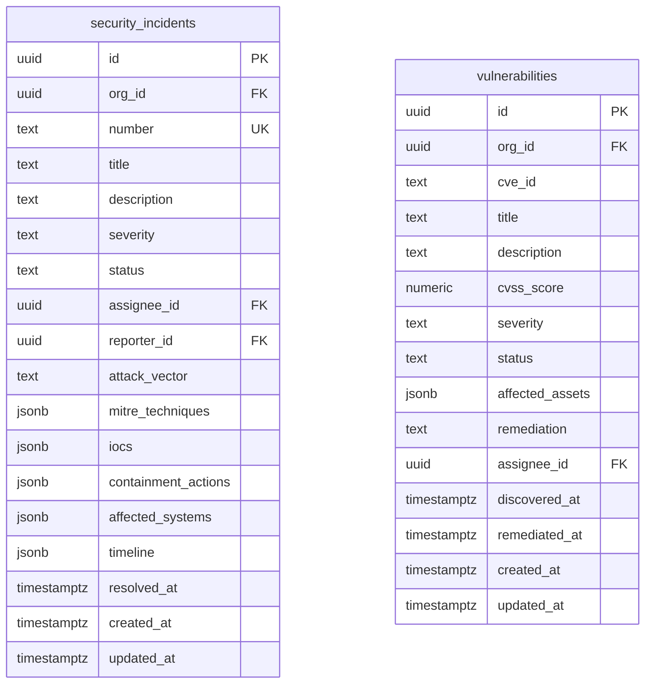
```mermaid
erDiagram
    security_incidents {
        uuid id PK
        uuid org_id FK
        text number UK
        text title
        text description
        text severity
        text status
        uuid assignee_id FK
        uuid reporter_id FK
        text attack_vector
        jsonb mitre_techniques
        jsonb iocs
        jsonb containment_actions
        jsonb affected_systems
        jsonb timeline
        timestamptz resolved_at
        timestamptz created_at
        timestamptz updated_at
    }

    vulnerabilities {
        uuid id PK
        uuid org_id FK
        text cve_id
        text title
        text description
        numeric cvss_score
        text severity
        text status
        jsonb affected_assets
        text remediation
        uuid assignee_id FK
        timestamptz discovered_at
        timestamptz remediated_at
        timestamptz created_at
        timestamptz updated_at
    }
```

---

## 11. Domain 9 — GRC: Governance, Risk & Compliance

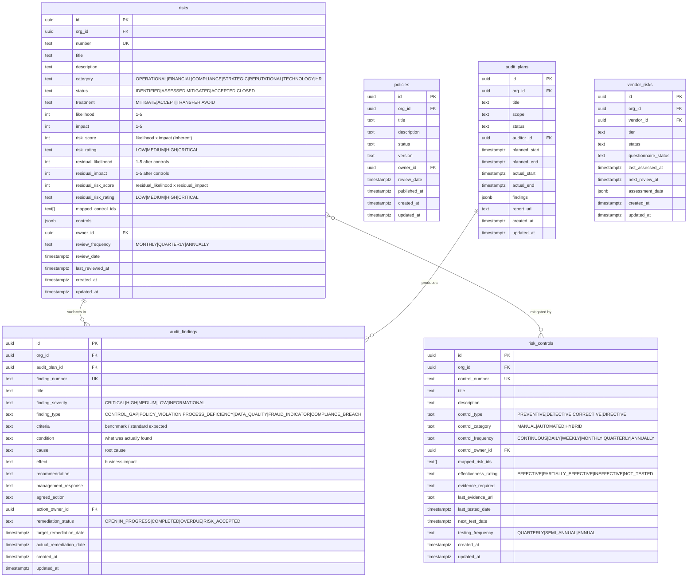
```mermaid
erDiagram
    risks {
        uuid id PK
        uuid org_id FK
        text number UK
        text title
        text description
        text category "OPERATIONAL|FINANCIAL|COMPLIANCE|STRATEGIC|REPUTATIONAL|TECHNOLOGY|HR"
        text status "IDENTIFIED|ASSESSED|MITIGATED|ACCEPTED|CLOSED"
        text treatment "MITIGATE|ACCEPT|TRANSFER|AVOID"
        int likelihood "1-5"
        int impact "1-5"
        int risk_score "likelihood x impact (inherent)"
        text risk_rating "LOW|MEDIUM|HIGH|CRITICAL"
        int residual_likelihood "1-5 after controls"
        int residual_impact "1-5 after controls"
        int residual_risk_score "residual_likelihood x residual_impact"
        text residual_risk_rating "LOW|MEDIUM|HIGH|CRITICAL"
        text[] mapped_control_ids
        jsonb controls
        uuid owner_id FK
        text review_frequency "MONTHLY|QUARTERLY|ANNUALLY"
        timestamptz review_date
        timestamptz last_reviewed_at
        timestamptz created_at
        timestamptz updated_at
    }

    risk_controls {
        uuid id PK
        uuid org_id FK
        text control_number UK
        text title
        text description
        text control_type "PREVENTIVE|DETECTIVE|CORRECTIVE|DIRECTIVE"
        text control_category "MANUAL|AUTOMATED|HYBRID"
        text control_frequency "CONTINUOUS|DAILY|WEEKLY|MONTHLY|QUARTERLY|ANNUALLY"
        uuid control_owner_id FK
        text[] mapped_risk_ids
        text effectiveness_rating "EFFECTIVE|PARTIALLY_EFFECTIVE|INEFFECTIVE|NOT_TESTED"
        text evidence_required
        text last_evidence_url
        timestamptz last_tested_date
        timestamptz next_test_date
        text testing_frequency "QUARTERLY|SEMI_ANNUAL|ANNUAL"
        timestamptz created_at
        timestamptz updated_at
    }

    audit_findings {
        uuid id PK
        uuid org_id FK
        uuid audit_plan_id FK
        text finding_number UK
        text title
        text finding_severity "CRITICAL|HIGH|MEDIUM|LOW|INFORMATIONAL"
        text finding_type "CONTROL_GAP|POLICY_VIOLATION|PROCESS_DEFICIENCY|DATA_QUALITY|FRAUD_INDICATOR|COMPLIANCE_BREACH"
        text criteria "benchmark / standard expected"
        text condition "what was actually found"
        text cause "root cause"
        text effect "business impact"
        text recommendation
        text management_response
        text agreed_action
        uuid action_owner_id FK
        text remediation_status "OPEN|IN_PROGRESS|COMPLETED|OVERDUE|RISK_ACCEPTED"
        timestamptz target_remediation_date
        timestamptz actual_remediation_date
        timestamptz created_at
        timestamptz updated_at
    }

    policies {
        uuid id PK
        uuid org_id FK
        text title
        text description
        text status
        text version
        uuid owner_id FK
        timestamptz review_date
        timestamptz published_at
        timestamptz created_at
        timestamptz updated_at
    }

    audit_plans {
        uuid id PK
        uuid org_id FK
        text title
        text scope
        text status
        uuid auditor_id FK
        timestamptz planned_start
        timestamptz planned_end
        timestamptz actual_start
        timestamptz actual_end
        jsonb findings
        text report_url
        timestamptz created_at
        timestamptz updated_at
    }

    vendor_risks {
        uuid id PK
        uuid org_id FK
        uuid vendor_id FK
        text tier
        text status
        text questionnaire_status
        timestamptz last_assessed_at
        timestamptz next_review_at
        jsonb assessment_data
        timestamptz created_at
        timestamptz updated_at
    }

    risks ||--o{ audit_findings : "surfaces in"
    risks }o--o{ risk_controls : "mitigated by"
    audit_plans ||--o{ audit_findings : "produces"
```

---

## 12. Domain 10 — Contracts & Legal

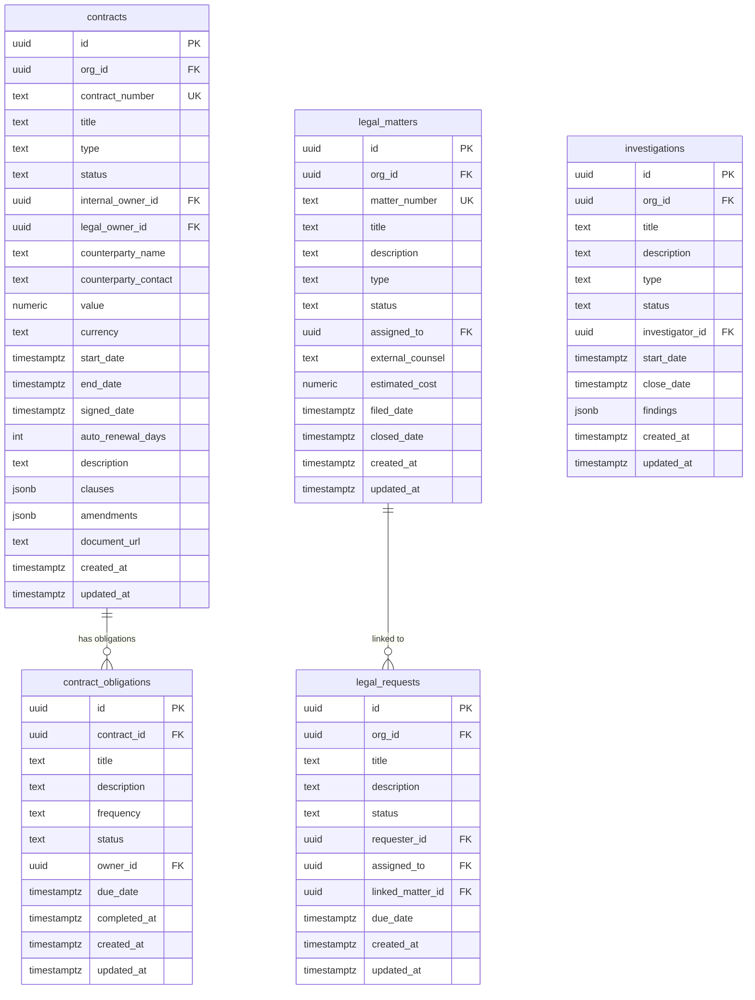
```mermaid
erDiagram
    contracts {
        uuid id PK
        uuid org_id FK
        text contract_number UK
        text title
        text type
        text status
        uuid internal_owner_id FK
        uuid legal_owner_id FK
        text counterparty_name
        text counterparty_contact
        numeric value
        text currency
        timestamptz start_date
        timestamptz end_date
        timestamptz signed_date
        int auto_renewal_days
        text description
        jsonb clauses
        jsonb amendments
        text document_url
        timestamptz created_at
        timestamptz updated_at
    }

    contract_obligations {
        uuid id PK
        uuid contract_id FK
        text title
        text description
        text frequency
        text status
        uuid owner_id FK
        timestamptz due_date
        timestamptz completed_at
        timestamptz created_at
        timestamptz updated_at
    }

    legal_matters {
        uuid id PK
        uuid org_id FK
        text matter_number UK
        text title
        text description
        text type
        text status
        uuid assigned_to FK
        text external_counsel
        numeric estimated_cost
        timestamptz filed_date
        timestamptz closed_date
        timestamptz created_at
        timestamptz updated_at
    }

    legal_requests {
        uuid id PK
        uuid org_id FK
        text title
        text description
        text status
        uuid requester_id FK
        uuid assigned_to FK
        uuid linked_matter_id FK
        timestamptz due_date
        timestamptz created_at
        timestamptz updated_at
    }

    investigations {
        uuid id PK
        uuid org_id FK
        text title
        text description
        text type
        text status
        uuid investigator_id FK
        timestamptz start_date
        timestamptz close_date
        jsonb findings
        timestamptz created_at
        timestamptz updated_at
    }

    contracts ||--o{ contract_obligations : "has obligations"
    legal_matters ||--o{ legal_requests : "linked to"
```

---

## 13. Domain 11 — Projects

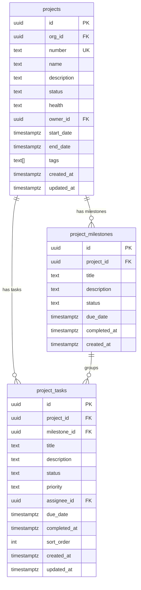
```mermaid
erDiagram
    projects {
        uuid id PK
        uuid org_id FK
        text number UK
        text name
        text description
        text status
        text health
        uuid owner_id FK
        timestamptz start_date
        timestamptz end_date
        text[] tags
        timestamptz created_at
        timestamptz updated_at
    }

    project_milestones {
        uuid id PK
        uuid project_id FK
        text title
        text description
        text status
        timestamptz due_date
        timestamptz completed_at
        timestamptz created_at
    }

    project_tasks {
        uuid id PK
        uuid project_id FK
        uuid milestone_id FK
        text title
        text description
        text status
        text priority
        uuid assignee_id FK
        timestamptz due_date
        timestamptz completed_at
        int sort_order
        timestamptz created_at
        timestamptz updated_at
    }

    projects ||--o{ project_milestones : "has milestones"
    projects ||--o{ project_tasks : "has tasks"
    project_milestones ||--o{ project_tasks : "groups"
```

---

## 14. Domain 12 — CRM: Customer Relationship Management

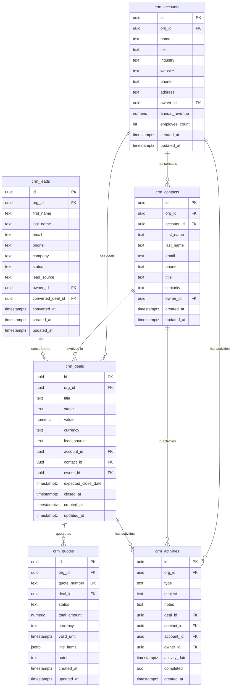
```mermaid
erDiagram
    crm_accounts {
        uuid id PK
        uuid org_id FK
        text name
        text tier
        text industry
        text website
        text phone
        text address
        uuid owner_id FK
        numeric annual_revenue
        int employee_count
        timestamptz created_at
        timestamptz updated_at
    }

    crm_contacts {
        uuid id PK
        uuid org_id FK
        uuid account_id FK
        text first_name
        text last_name
        text email
        text phone
        text title
        text seniority
        uuid owner_id FK
        timestamptz created_at
        timestamptz updated_at
    }

    crm_deals {
        uuid id PK
        uuid org_id FK
        text title
        text stage
        numeric value
        text currency
        text lead_source
        uuid account_id FK
        uuid contact_id FK
        uuid owner_id FK
        timestamptz expected_close_date
        timestamptz closed_at
        timestamptz created_at
        timestamptz updated_at
    }

    crm_leads {
        uuid id PK
        uuid org_id FK
        text first_name
        text last_name
        text email
        text phone
        text company
        text status
        text lead_source
        uuid owner_id FK
        uuid converted_deal_id FK
        timestamptz converted_at
        timestamptz created_at
        timestamptz updated_at
    }

    crm_activities {
        uuid id PK
        uuid org_id FK
        text type
        text subject
        text notes
        uuid deal_id FK
        uuid contact_id FK
        uuid account_id FK
        uuid owner_id FK
        timestamptz activity_date
        bool completed
        timestamptz created_at
    }

    crm_quotes {
        uuid id PK
        uuid org_id FK
        text quote_number UK
        uuid deal_id FK
        text status
        numeric total_amount
        text currency
        timestamptz valid_until
        jsonb line_items
        text notes
        timestamptz created_at
        timestamptz updated_at
    }

    crm_accounts ||--o{ crm_contacts : "has contacts"
    crm_accounts ||--o{ crm_deals : "has deals"
    crm_accounts ||--o{ crm_activities : "has activities"
    crm_contacts ||--o{ crm_deals : "involved in"
    crm_contacts ||--o{ crm_activities : "in activities"
    crm_deals ||--o{ crm_quotes : "quoted as"
    crm_deals ||--o{ crm_activities : "has activities"
    crm_leads ||--o{ crm_deals : "converted to"
```

---

## 15. Domain 13 — Knowledge Base & Portal

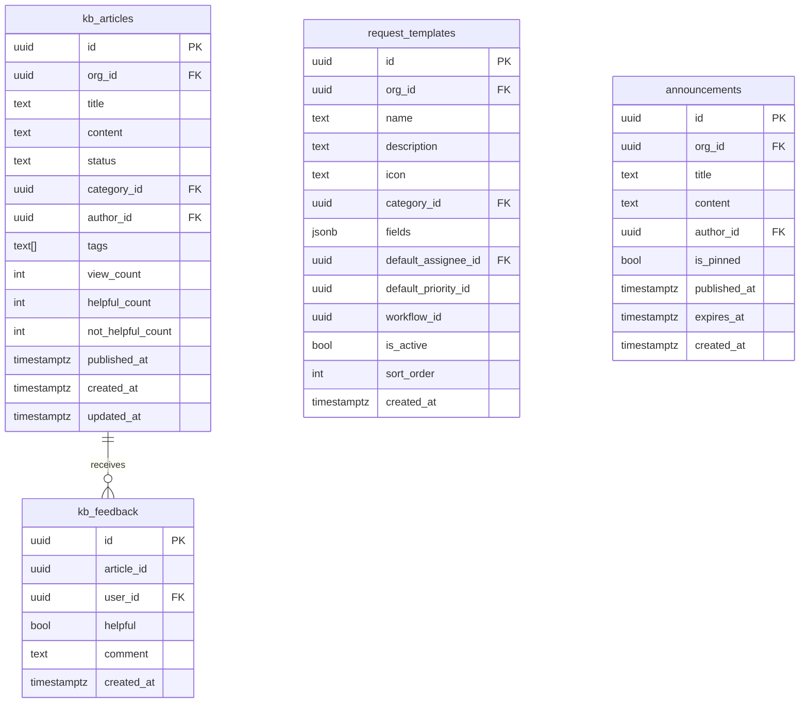
```mermaid
erDiagram
    kb_articles {
        uuid id PK
        uuid org_id FK
        text title
        text content
        text status
        uuid category_id FK
        uuid author_id FK
        text[] tags
        int view_count
        int helpful_count
        int not_helpful_count
        timestamptz published_at
        timestamptz created_at
        timestamptz updated_at
    }

    kb_feedback {
        uuid id PK
        uuid article_id
        uuid user_id FK
        bool helpful
        text comment
        timestamptz created_at
    }

    request_templates {
        uuid id PK
        uuid org_id FK
        text name
        text description
        text icon
        uuid category_id FK
        jsonb fields
        uuid default_assignee_id FK
        uuid default_priority_id
        uuid workflow_id
        bool is_active
        int sort_order
        timestamptz created_at
    }

    announcements {
        uuid id PK
        uuid org_id FK
        text title
        text content
        uuid author_id FK
        bool is_pinned
        timestamptz published_at
        timestamptz expires_at
        timestamptz created_at
    }

    kb_articles ||--o{ kb_feedback : "receives"
```

---

## 16. Domain 14 — Approvals

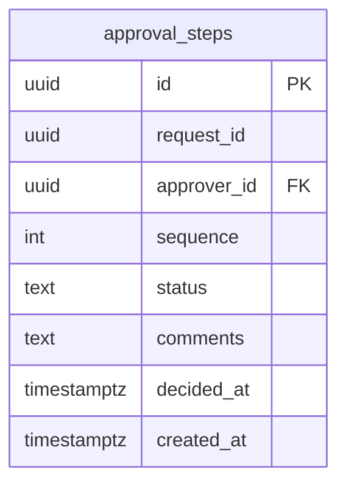
```mermaid
erDiagram
    approval_steps {
        uuid id PK
        uuid request_id
        uuid approver_id FK
        int sequence
        text status
        text comments
        timestamptz decided_at
        timestamptz created_at
    }
```

> `approval_steps.request_id` references `approval_requests` from Domain 6 (Procurement). The FK is not declared in Drizzle but is enforced at the application level.

---

## 17. Domain 15 — Notifications

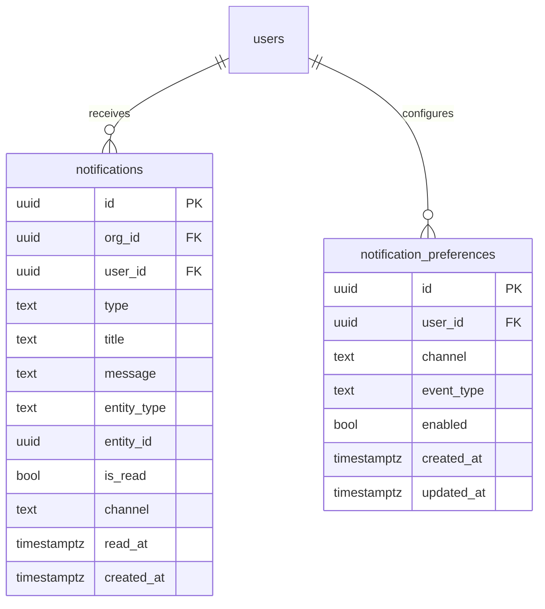
```mermaid
erDiagram
    notifications {
        uuid id PK
        uuid org_id FK
        uuid user_id FK
        text type
        text title
        text message
        text entity_type
        uuid entity_id
        bool is_read
        text channel
        timestamptz read_at
        timestamptz created_at
    }

    notification_preferences {
        uuid id PK
        uuid user_id FK
        text channel
        text event_type
        bool enabled
        timestamptz created_at
        timestamptz updated_at
    }

    users ||--o{ notifications : "receives"
    users ||--o{ notification_preferences : "configures"
```

---

## 18. Domain 16 — Facilities & Workplace

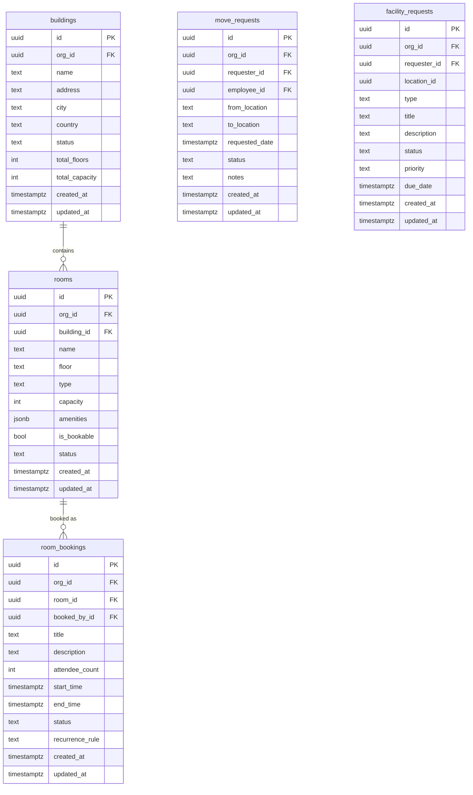
```mermaid
erDiagram
    buildings {
        uuid id PK
        uuid org_id FK
        text name
        text address
        text city
        text country
        text status
        int total_floors
        int total_capacity
        timestamptz created_at
        timestamptz updated_at
    }

    rooms {
        uuid id PK
        uuid org_id FK
        uuid building_id FK
        text name
        text floor
        text type
        int capacity
        jsonb amenities
        bool is_bookable
        text status
        timestamptz created_at
        timestamptz updated_at
    }

    room_bookings {
        uuid id PK
        uuid org_id FK
        uuid room_id FK
        uuid booked_by_id FK
        text title
        text description
        int attendee_count
        timestamptz start_time
        timestamptz end_time
        text status
        text recurrence_rule
        timestamptz created_at
        timestamptz updated_at
    }

    move_requests {
        uuid id PK
        uuid org_id FK
        uuid requester_id FK
        uuid employee_id FK
        text from_location
        text to_location
        timestamptz requested_date
        text status
        text notes
        timestamptz created_at
        timestamptz updated_at
    }

    facility_requests {
        uuid id PK
        uuid org_id FK
        uuid requester_id FK
        uuid location_id
        text type
        text title
        text description
        text status
        text priority
        timestamptz due_date
        timestamptz created_at
        timestamptz updated_at
    }

    buildings ||--o{ rooms : "contains"
    rooms ||--o{ room_bookings : "booked as"
```

---

## 19. Domain 17 — DevOps & Deployments

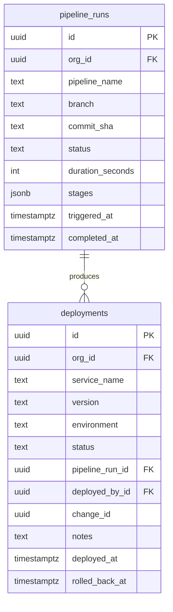
```mermaid
erDiagram
    pipeline_runs {
        uuid id PK
        uuid org_id FK
        text pipeline_name
        text branch
        text commit_sha
        text status
        int duration_seconds
        jsonb stages
        timestamptz triggered_at
        timestamptz completed_at
    }

    deployments {
        uuid id PK
        uuid org_id FK
        text service_name
        text version
        text environment
        text status
        uuid pipeline_run_id FK
        uuid deployed_by_id FK
        uuid change_id
        text notes
        timestamptz deployed_at
        timestamptz rolled_back_at
    }

    pipeline_runs ||--o{ deployments : "produces"
```

> `deployments.change_id` is intended to reference `change_requests` but the FK constraint is not declared in the Drizzle schema.

---

## 20. Domain 18 — Surveys

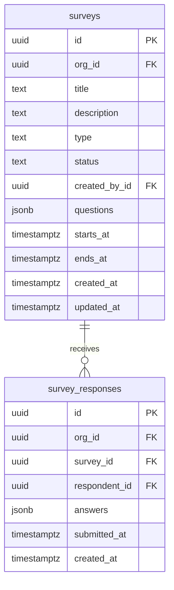
```mermaid
erDiagram
    surveys {
        uuid id PK
        uuid org_id FK
        text title
        text description
        text type
        text status
        uuid created_by_id FK
        jsonb questions
        timestamptz starts_at
        timestamptz ends_at
        timestamptz created_at
        timestamptz updated_at
    }

    survey_responses {
        uuid id PK
        uuid org_id FK
        uuid survey_id FK
        uuid respondent_id FK
        jsonb answers
        timestamptz submitted_at
        timestamptz created_at
    }

    surveys ||--o{ survey_responses : "receives"
```

---

## 21. Domain 19 — Walk-Up Service Desk

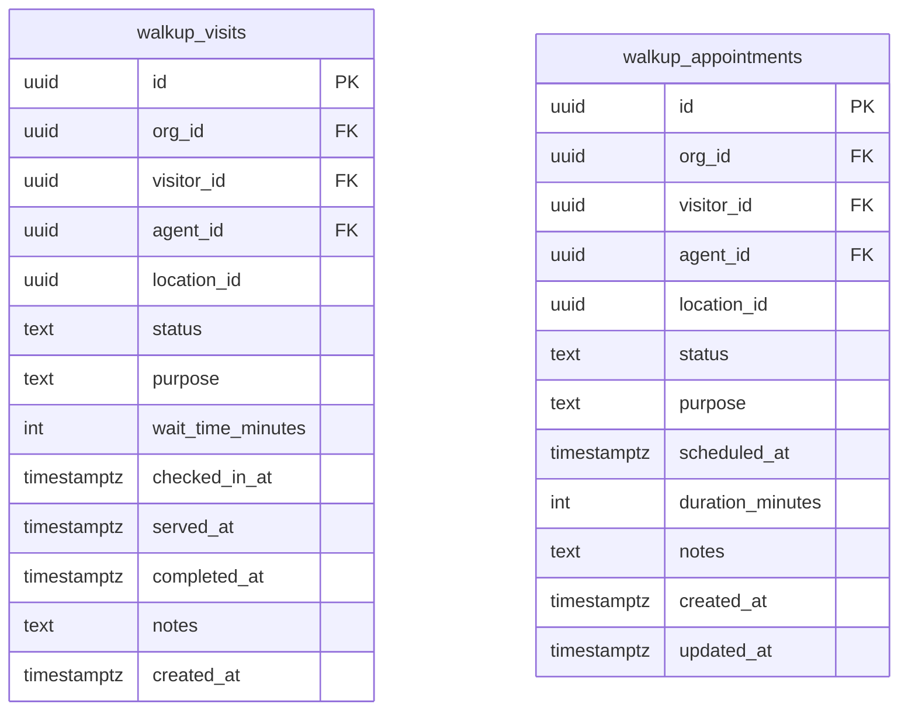
```mermaid
erDiagram
    walkup_visits {
        uuid id PK
        uuid org_id FK
        uuid visitor_id FK
        uuid agent_id FK
        uuid location_id
        text status
        text purpose
        int wait_time_minutes
        timestamptz checked_in_at
        timestamptz served_at
        timestamptz completed_at
        text notes
        timestamptz created_at
    }

    walkup_appointments {
        uuid id PK
        uuid org_id FK
        uuid visitor_id FK
        uuid agent_id FK
        uuid location_id
        text status
        text purpose
        timestamptz scheduled_at
        int duration_minutes
        text notes
        timestamptz created_at
        timestamptz updated_at
    }
```

---

## 22. Domain 20 — Application Portfolio Management (APM)

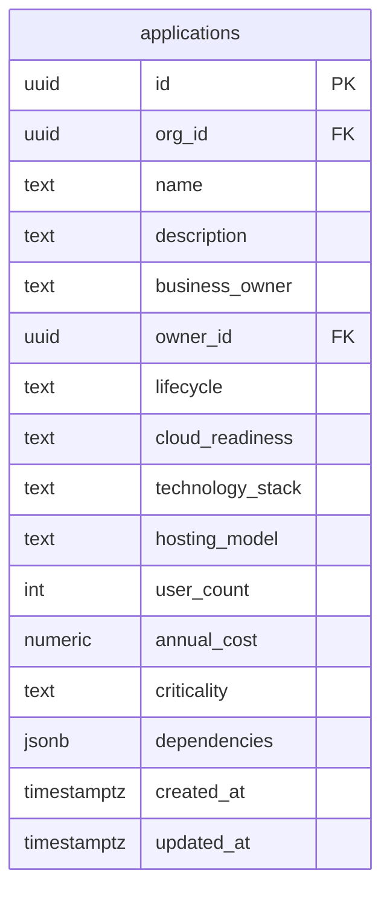
```mermaid
erDiagram
    applications {
        uuid id PK
        uuid org_id FK
        text name
        text description
        text business_owner
        uuid owner_id FK
        text lifecycle
        text cloud_readiness
        text technology_stack
        text hosting_model
        int user_count
        numeric annual_cost
        text criticality
        jsonb dependencies
        timestamptz created_at
        timestamptz updated_at
    }
```

---

## 23. Domain 21 — On-Call Management

```mermaid
erDiagram
    oncall_schedules {
        uuid id PK
        uuid org_id FK
        text name
        text description
        text rotation_type
        int rotation_length_days
        jsonb participants
        timestamptz start_date
        jsonb escalation_policy
        timestamptz created_at
        timestamptz updated_at
    }

    oncall_overrides {
        uuid id PK
        uuid schedule_id FK
        uuid user_id FK
        timestamptz start_time
        timestamptz end_time
        text reason
        timestamptz created_at
    }

    oncall_schedules ||--o{ oncall_overrides : "overridden by"
```

---

## 24. Domain 22 — Service Catalog

```mermaid
erDiagram
    catalog_items {
        uuid id PK
        uuid org_id FK
        text name
        text description
        text category
        text icon
        text status
        jsonb fields
        uuid default_assignee_id FK
        int fulfillment_time_hours
        bool requires_approval
        int sort_order
        timestamptz created_at
        timestamptz updated_at
    }

    catalog_requests {
        uuid id PK
        uuid org_id FK
        uuid catalog_item_id FK
        uuid requester_id FK
        uuid assignee_id FK
        text status
        jsonb field_values
        uuid approval_id
        timestamptz created_at
        timestamptz updated_at
    }

    catalog_items ||--o{ catalog_requests : "requested as"
```

> `catalog_requests.approval_id` is intended to reference an approval record but is not declared as a Drizzle FK.

---

## 25. Domain 23 — Integrations & Webhooks

```mermaid
erDiagram
    integrations {
        uuid id PK
        uuid org_id FK
        text name
        text type
        text status
        jsonb config
        jsonb credentials
        timestamptz last_sync_at
        timestamptz created_at
        timestamptz updated_at
    }

    integration_sync_logs {
        uuid id PK
        uuid integration_id FK
        text status
        int records_synced
        text error
        timestamptz started_at
        timestamptz completed_at
    }

    webhooks {
        uuid id PK
        uuid org_id FK
        text name
        text url
        text[] events
        text secret
        bool is_active
        timestamptz created_at
        timestamptz updated_at
    }

    webhook_deliveries {
        uuid id PK
        uuid webhook_id FK
        text event
        jsonb payload
        int response_status
        text response_body
        text status
        int attempt_count
        timestamptz created_at
    }

    ai_usage_logs {
        uuid id PK
        uuid org_id FK
        uuid user_id FK
        text model
        text operation
        int prompt_tokens
        int completion_tokens
        int total_tokens
        numeric cost
        timestamptz created_at
    }

    integrations ||--o{ integration_sync_logs : "has sync logs"
    webhooks ||--o{ webhook_deliveries : "delivery attempts"
```

---

## 26. Domain 24 — Work Orders

```mermaid
erDiagram
    work_orders {
        uuid id PK
        uuid org_id FK
        text number UK
        text title
        text description
        text type
        text priority
        text state
        uuid assigned_to_id FK
        uuid requested_by_id FK
        timestamptz due_date
        timestamptz scheduled_start
        timestamptz scheduled_end
        timestamptz actual_start
        timestamptz actual_end
        jsonb parts_used
        jsonb attachments
        text notes
        timestamptz created_at
        timestamptz updated_at
    }

    work_order_tasks {
        uuid id PK
        uuid work_order_id FK
        uuid org_id FK
        text title
        text description
        text state
        uuid assigned_to_id FK
        int sort_order
        timestamptz completed_at
        timestamptz created_at
    }

    work_order_activity_logs {
        uuid id PK
        uuid work_order_id FK
        uuid user_id FK
        text action
        jsonb changes
        timestamptz created_at
    }

    work_orders ||--o{ work_order_tasks : "broken into"
    work_orders ||--o{ work_order_activity_logs : "tracked in"
```

---

## 27. Cross-Domain Relationship Map

The following table summarises all cross-domain FK relationships (references from one domain's tables to another domain's tables).

| Child Table | Child Column | Parent Table | Parent Domain | On Delete |
|-------------|-------------|-------------|--------------|-----------|
| `users` | `org_id` | `organizations` | Core | Cascade |
| `sessions` | `user_id` | `users` | Core | Cascade |
| `accounts` | `user_id` | `users` | Core | Cascade |
| `api_keys` | `org_id` | `organizations` | Core | Cascade |
| `api_keys` | `created_by_id` | `users` | Core | — |
| `roles` | `org_id` | `organizations` | Core | Cascade |
| `audit_logs` | `org_id` | `organizations` | Core | Cascade |
| `audit_logs` | `user_id` | `users` | Core | Set Null |
| `invites` | `org_id` | `organizations` | Core | Cascade |
| `invites` | `invited_by_user_id` | `users` | Core | — |
| `ticket_categories` | `org_id` | `organizations` | Core | Cascade |
| `ticket_priorities` | `org_id` | `organizations` | Core | Cascade |
| `ticket_statuses` | `org_id` | `organizations` | Core | Cascade |
| `teams` | `org_id` | `organizations` | Core | Cascade |
| `tickets` | `org_id` | `organizations` | Core | Cascade |
| `tickets` | `requester_id` | `users` | Core | — |
| `tickets` | `assignee_id` | `users` | Core | Set Null |
| `ticket_comments` | `author_id` | `users` | Core | — |
| `ticket_watchers` | `user_id` | `users` | Core | Cascade |
| `sla_policies` | `org_id` | `organizations` | Core | Cascade |
| `assets` | `org_id` | `organizations` | Core | Cascade |
| `assets` | `type_id` | `asset_types` | Assets | — |
| `assets` | `owner_id` | `users` | Core | Set Null |
| `asset_history` | `actor_id` | `users` | Core | Set Null |
| `license_assignments` | `user_id` | `users` | Core | Cascade |
| `software_licenses` | `org_id` | `organizations` | Core | Cascade |
| `workflows` | `org_id` | `organizations` | Core | Cascade |
| `workflows` | `created_by_id` | `users` | Core | — |
| `employees` | `org_id` | `organizations` | Core | Cascade |
| `employees` | `user_id` | `users` | Core | Cascade |
| `hr_cases` | `employee_id` | `employees` | HR | Cascade |
| `hr_cases` | `status_id` | `ticket_statuses` | ITSM | — |
| `hr_cases` | `assignee_id` | `users` | Core | Set Null |
| `leave_requests` | `approved_by_id` | `users` | Core | Set Null |
| `purchase_requests` | `requester_id` | `users` | Core | — |
| `purchase_requests` | `current_approver_id` | `users` | Core | Set Null |
| `purchase_request_items` | `vendor_id` | `vendors` | Procurement | Set Null |
| `purchase_request_items` | `asset_type_id` | `asset_types` | Assets | Set Null |
| `purchase_orders` | `vendor_id` | `vendors` | Procurement | — |
| `purchase_orders` | `pr_id` | `purchase_requests` | Procurement | Set Null |
| `invoices` | `vendor_id` | `vendors` | Procurement | — |
| `invoices` | `po_id` | `purchase_orders` | Procurement | Set Null |
| `change_requests` | `requester_id` | `users` | Core | — |
| `change_requests` | `assignee_id` | `users` | Core | Set Null |
| `change_approvals` | `approver_id` | `users` | Core | — |
| `problems` | `assignee_id` | `users` | Core | Set Null |
| `known_errors` | `problem_id` | `problems` | Changes | Set Null |
| `security_incidents` | `assignee_id` | `users` | Core | — |
| `security_incidents` | `reporter_id` | `users` | Core | — |
| `vulnerabilities` | `assignee_id` | `users` | Core | — |
| `risks` | `owner_id` | `users` | Core | — |
| `policies` | `owner_id` | `users` | Core | — |
| `audit_plans` | `auditor_id` | `users` | Core | — |
| `vendor_risks` | `vendor_id` | `vendors` | Procurement | — |
| `contracts` | `internal_owner_id` | `users` | Core | — |
| `contracts` | `legal_owner_id` | `users` | Core | — |
| `contract_obligations` | `owner_id` | `users` | Core | — |
| `legal_requests` | `requester_id` | `users` | Core | — |
| `legal_requests` | `assigned_to` | `users` | Core | — |
| `legal_requests` | `linked_matter_id` | `legal_matters` | Contracts | Set Null |
| `investigations` | `investigator_id` | `users` | Core | Set Null |
| `projects` | `owner_id` | `users` | Core | — |
| `project_tasks` | `assignee_id` | `users` | Core | — |
| `crm_accounts` | `owner_id` | `users` | Core | — |
| `crm_contacts` | `account_id` | `crm_accounts` | CRM | — |
| `crm_contacts` | `owner_id` | `users` | Core | — |
| `crm_deals` | `account_id` | `crm_accounts` | CRM | — |
| `crm_deals` | `contact_id` | `crm_contacts` | CRM | — |
| `crm_deals` | `owner_id` | `users` | Core | — |
| `crm_leads` | `owner_id` | `users` | Core | — |
| `crm_leads` | `converted_deal_id` | `crm_deals` | CRM | — |
| `kb_articles` | `category_id` | `ticket_categories` | ITSM | Set Null |
| `kb_articles` | `author_id` | `users` | Core | — |
| `announcements` | `author_id` | `users` | Core | — |
| `approval_steps` | `approver_id` | `users` | Core | — |
| `notifications` | `user_id` | `users` | Core | — |
| `notification_preferences` | `user_id` | `users` | Core | — |
| `rooms` | `building_id` | `buildings` | Facilities | — |
| `room_bookings` | `room_id` | `rooms` | Facilities | — |
| `room_bookings` | `booked_by_id` | `users` | Core | — |
| `deployments` | `pipeline_run_id` | `pipeline_runs` | DevOps | Set Null |
| `deployments` | `deployed_by_id` | `users` | Core | Set Null |
| `surveys` | `created_by_id` | `users` | Core | — |
| `survey_responses` | `respondent_id` | `users` | Core | — |
| `catalog_items` | `default_assignee_id` | `users` | Core | — |
| `catalog_requests` | `catalog_item_id` | `catalog_items` | Catalog | — |
| `catalog_requests` | `requester_id` | `users` | Core | — |
| `catalog_requests` | `assignee_id` | `users` | Core | — |
| `integrations` | `org_id` | `organizations` | Core | Cascade |
| `integration_sync_logs` | `integration_id` | `integrations` | Integrations | — |
| `webhooks` | `org_id` | `organizations` | Core | Cascade |
| `webhook_deliveries` | `webhook_id` | `webhooks` | Integrations | — |
| `ai_usage_logs` | `user_id` | `users` | Core | — |
| `work_orders` | `assigned_to_id` | `users` | Core | — |
| `work_orders` | `requested_by_id` | `users` | Core | — |
| `work_order_tasks` | `assigned_to_id` | `users` | Core | — |
| `work_order_activity_logs` | `user_id` | `users` | Core | — |

---

## 28. Complete Table Reference

The following reference lists every table with its full column specification.

### Core / Auth Domain

#### `organizations`
| Column | Type | Constraints | Default |
|--------|------|------------|---------|
| `id` | `uuid` | PK | `gen_random_uuid()` |
| `name` | `text` | NOT NULL | — |
| `slug` | `text` | NOT NULL, UNIQUE | — |
| `plan` | `enum(org_plan)` | NOT NULL | `free` |
| `settings` | `jsonb` | — | — |
| `logo_url` | `text` | — | — |
| `primary_color` | `text` | — | `#6366f1` |
| `created_at` | `timestamptz` | NOT NULL | `now()` |
| `updated_at` | `timestamptz` | NOT NULL | `now()` |

#### `users`
| Column | Type | Constraints | Default |
|--------|------|------------|---------|
| `id` | `uuid` | PK | `gen_random_uuid()` |
| `org_id` | `uuid` | FK → `organizations`, NOT NULL | — |
| `email` | `text` | NOT NULL, UNIQUE per org | — |
| `name` | `text` | NOT NULL | — |
| `password_hash` | `text` | — | — |
| `avatar_url` | `text` | — | — |
| `role` | `enum(user_role)` | NOT NULL | `member` |
| `matrix_role` | `text` | — | — |
| `status` | `enum(user_status)` | NOT NULL | `invited` |
| `last_login_at` | `timestamptz` | — | — |
| `created_at` | `timestamptz` | NOT NULL | `now()` |
| `updated_at` | `timestamptz` | NOT NULL | `now()` |

**Indexes:** UNIQUE (`org_id`, `email`), INDEX (`org_id`)

#### `sessions`
| Column | Type | Constraints | Notes |
|--------|------|------------|-------|
| `id` | `text` | PK | SHA-256 hash of the bearer token |
| `user_id` | `uuid` | FK → `users` CASCADE, NOT NULL | — |
| `expires_at` | `timestamptz` | NOT NULL | — |
| `ip_address` | `text` | — | — |
| `user_agent` | `text` | — | — |
| `created_at` | `timestamptz` | NOT NULL | `now()` |

#### `api_keys`
| Column | Type | Constraints | Default |
|--------|------|------------|---------|
| `id` | `uuid` | PK | `gen_random_uuid()` |
| `org_id` | `uuid` | FK → `organizations` CASCADE | — |
| `created_by_id` | `uuid` | FK → `users` | — |
| `name` | `text` | NOT NULL | — |
| `key_hash` | `text` | NOT NULL, UNIQUE | SHA-256 of raw key |
| `key_prefix` | `text` | NOT NULL | e.g. `nxo_` |
| `permissions` | `jsonb` | NOT NULL | `{}` |
| `last_used_at` | `timestamptz` | — | — |
| `expires_at` | `timestamptz` | — | — |
| `created_at` | `timestamptz` | NOT NULL | `now()` |

#### `audit_logs`
| Column | Type | Constraints | Default |
|--------|------|------------|---------|
| `id` | `uuid` | PK | `gen_random_uuid()` |
| `org_id` | `uuid` | FK → `organizations` CASCADE | — |
| `user_id` | `uuid` | FK → `users` SET NULL | — |
| `action` | `text` | NOT NULL | tRPC procedure path |
| `resource_type` | `text` | NOT NULL | — |
| `resource_id` | `text` | — | — |
| `changes` | `jsonb` | — | Sanitised input |
| `ip_address` | `text` | — | — |
| `user_agent` | `text` | — | — |
| `created_at` | `timestamptz` | NOT NULL | `now()` |

**Indexes:** INDEX (`org_id`), INDEX (`created_at`), INDEX (`resource_type`, `resource_id`)

#### `org_counters`
| Column | Type | Constraints | Default |
|--------|------|------------|---------|
| `org_id` | `text` | PK (composite) | — |
| `entity` | `text` | PK (composite) | — |
| `current_value` | `bigint` | NOT NULL | `0` |

**Composite PK:** (`org_id`, `entity`) — used for generating sequential reference numbers (ticket numbers, PR numbers, etc.)

---

### ITSM / Ticketing Domain

#### `tickets`
| Column | Type | Constraints | Default |
|--------|------|------------|---------|
| `id` | `uuid` | PK | `gen_random_uuid()` |
| `org_id` | `uuid` | FK → `organizations` CASCADE | — |
| `number` | `text` | NOT NULL, UNIQUE per org | From `org_counters` |
| `title` | `text` | NOT NULL | — |
| `description` | `text` | — | — |
| `category_id` | `uuid` | FK → `ticket_categories` SET NULL | — |
| `priority_id` | `uuid` | FK → `ticket_priorities` SET NULL | — |
| `status_id` | `uuid` | FK → `ticket_statuses`, NOT NULL | — |
| `type` | `enum(ticket_type)` | NOT NULL | `request` |
| `requester_id` | `uuid` | FK → `users`, NOT NULL | — |
| `assignee_id` | `uuid` | FK → `users` SET NULL | — |
| `team_id` | `uuid` | FK → `teams` SET NULL | — |
| `due_date` | `timestamptz` | — | — |
| `sla_breached` | `boolean` | NOT NULL | `false` |
| `sla_response_due_at` | `timestamptz` | — | — |
| `sla_resolve_due_at` | `timestamptz` | — | — |
| `sla_responded_at` | `timestamptz` | — | — |
| `tags` | `text[]` | NOT NULL | `{}` |
| `custom_fields` | `jsonb` | — | — |
| `resolved_at` | `timestamptz` | — | — |
| `closed_at` | `timestamptz` | — | — |
| `search_vector` | `text` | — | Full-text search vector |
| `idempotency_key` | `text` | UNIQUE | Prevents duplicate creation |
| `version` | `integer` | NOT NULL | `1` |
| `created_at` | `timestamptz` | NOT NULL | `now()` |
| `updated_at` | `timestamptz` | NOT NULL | `now()` |

**Indexes:** UNIQUE (`org_id`, `number`), INDEX (`org_id`), INDEX (`status_id`), INDEX (`assignee_id`), INDEX (`requester_id`), INDEX (`created_at`)

#### `sla_policies`
| Column | Type | Constraints | Default |
|--------|------|------------|---------|
| `id` | `uuid` | PK | `gen_random_uuid()` |
| `org_id` | `uuid` | FK → `organizations` CASCADE | — |
| `name` | `text` | NOT NULL | — |
| `conditions` | `jsonb` | NOT NULL | `{}` |
| `response_time_minutes` | `integer` | — | — |
| `resolve_time_minutes` | `integer` | — | — |
| `escalation_rules` | `jsonb` | — | — |
| `is_active` | `boolean` | NOT NULL | `true` |
| `created_at` | `timestamptz` | NOT NULL | `now()` |

---

### Assets & CMDB Domain

#### `assets`
| Column | Type | Constraints | Default |
|--------|------|------------|---------|
| `id` | `uuid` | PK | `gen_random_uuid()` |
| `org_id` | `uuid` | FK → `organizations` CASCADE | — |
| `asset_tag` | `text` | NOT NULL, UNIQUE per org | — |
| `name` | `text` | NOT NULL | — |
| `type_id` | `uuid` | FK → `asset_types`, NOT NULL | — |
| `status` | `enum(asset_status)` | NOT NULL | `in_stock` |
| `owner_id` | `uuid` | FK → `users` SET NULL | — |
| `location` | `text` | — | — |
| `purchase_date` | `timestamptz` | — | — |
| `purchase_cost` | `numeric(12,2)` | — | — |
| `warranty_expiry` | `timestamptz` | — | — |
| `vendor` | `text` | — | — |
| `custom_fields` | `jsonb` | — | — |
| `parent_asset_id` | `uuid` | — (no FK constraint) | — |
| `created_at` | `timestamptz` | NOT NULL | `now()` |
| `updated_at` | `timestamptz` | NOT NULL | `now()` |

**Indexes:** UNIQUE (`org_id`, `asset_tag`)

---

### Procurement & Finance Domain

#### `vendors`
| Column | Type | Constraints | Default |
|--------|------|------------|---------|
| `id` | `uuid` | PK | `gen_random_uuid()` |
| `org_id` | `uuid` | FK → `organizations` CASCADE | — |
| `name` | `text` | NOT NULL | — |
| `contact_email` | `text` | — | — |
| `contact_phone` | `text` | — | — |
| `address` | `text` | — | — |
| `payment_terms` | `text` | — | — |
| `status` | `text` | NOT NULL | `active` |
| `rating` | `numeric(3,1)` | — | 1–5 rating |
| `notes` | `text` | — | — |
| `created_at` | `timestamptz` | NOT NULL | `now()` |
| `updated_at` | `timestamptz` | NOT NULL | `now()` |

#### `purchase_orders`
| Column | Type | Constraints | Default |
|--------|------|------------|---------|
| `id` | `uuid` | PK | `gen_random_uuid()` |
| `org_id` | `uuid` | FK → `organizations` CASCADE | — |
| `po_number` | `text` | NOT NULL, UNIQUE per org | — |
| `pr_id` | `uuid` | FK → `purchase_requests` SET NULL | — |
| `vendor_id` | `uuid` | FK → `vendors`, NOT NULL | — |
| `total_amount` | `numeric(14,2)` | NOT NULL | — |
| `status` | `enum(po_status)` | NOT NULL | `draft` |
| `expected_delivery` | `timestamptz` | — | — |
| `notes` | `text` | — | — |
| `created_at` | `timestamptz` | NOT NULL | `now()` |
| `updated_at` | `timestamptz` | NOT NULL | `now()` |

#### `budget_lines`
| Column | Type | Constraints | Default |
|--------|------|------------|---------|
| `id` | `uuid` | PK | `gen_random_uuid()` |
| `org_id` | `uuid` | FK → `organizations` CASCADE | — |
| `category` | `text` | NOT NULL | — |
| `department` | `text` | — | — |
| `fiscal_year` | `integer` | NOT NULL | — |
| `budgeted` | `numeric(14,2)` | NOT NULL | `0` |
| `committed` | `numeric(14,2)` | NOT NULL | `0` |
| `actual` | `numeric(14,2)` | NOT NULL | `0` |
| `forecast` | `numeric(14,2)` | NOT NULL | `0` |
| `notes` | `text` | — | — |
| `created_at` | `timestamptz` | NOT NULL | `now()` |
| `updated_at` | `timestamptz` | NOT NULL | `now()` |

---

## 29. PostgreSQL Enum Reference

All 82 PostgreSQL enum types defined across the schema:

### Core / Auth
| Enum | Values |
|------|--------|
| `org_plan` | `free`, `starter`, `professional`, `enterprise` |
| `user_role` | `owner`, `admin`, `member`, `viewer` |
| `user_status` | `active`, `invited`, `disabled` |
| `permission_action` | `create`, `read`, `update`, `delete`, `manage` |

### ITSM / Ticketing
| Enum | Values |
|------|--------|
| `ticket_type` | `incident`, `request`, `problem`, `change` |
| `ticket_status_category` | `open`, `in_progress`, `resolved`, `closed` |
| `ticket_relation_type` | `blocks`, `blocked_by`, `duplicate`, `related` |

### Assets & CMDB
| Enum | Values |
|------|--------|
| `asset_status` | `in_stock`, `deployed`, `maintenance`, `retired`, `disposed` |
| `ci_type` | `server`, `application`, `database`, `network`, `service`, `cloud` |
| `ci_status` | `operational`, `degraded`, `down`, `planned` |
| `ci_relation_type` | `depends_on`, `runs_on`, `connected_to`, `member_of`, `hosts` |
| `license_type` | `per_seat`, `device`, `site`, `enterprise` |

### Workflows
| Enum | Values |
|------|--------|
| `workflow_trigger_type` | `ticket_created`, `ticket_updated`, `status_changed`, `scheduled`, `manual`, `webhook` |
| `workflow_run_status` | `running`, `completed`, `failed`, `cancelled`, `waiting` |
| `workflow_step_status` | `pending`, `running`, `completed`, `failed`, `skipped`, `waiting` |

### HR & People
| Enum | Values |
|------|--------|
| `employment_type` | `full_time`, `part_time`, `contractor`, `intern` |
| `employee_status` | `active`, `on_leave`, `offboarded` |
| `hr_case_type` | `onboarding`, `offboarding`, `leave`, `policy`, `benefits`, `workplace`, `equipment` |
| `leave_type` | `vacation`, `sick`, `parental`, `bereavement`, `unpaid`, `other` |
| `leave_status` | `pending`, `approved`, `rejected`, `cancelled` |

### Procurement & Finance
| Enum | Values |
|------|--------|
| `pr_status` | `draft`, `pending`, `approved`, `rejected`, `ordered`, `received`, `closed` |
| `po_status` | `draft`, `sent`, `acknowledged`, `partially_received`, `received`, `invoiced`, `paid`, `cancelled` |
| `invoice_status` | `pending`, `approved`, `paid`, `overdue`, `disputed` |

### Change Management
| Enum | Values |
|------|--------|
| `change_type` | `normal`, `standard`, `emergency`, `expedited` |
| `change_risk` | `low`, `medium`, `high`, `critical` |
| `change_status` | `draft`, `submitted`, `cab_review`, `approved`, `scheduled`, `implementing`, `completed`, `failed`, `cancelled` |
| `change_approval_decision` | `pending`, `approved`, `rejected` |
| `problem_status` | `new`, `investigation`, `root_cause_identified`, `known_error`, `resolved`, `closed` |
| `release_status` | `planning`, `build`, `test`, `deploy`, `completed`, `cancelled` |

### Security
| Enum | Values |
|------|--------|
| `sec_incident_severity` | `critical`, `high`, `medium`, `low`, `informational` |
| `sec_incident_status` | `new`, `triage`, `containment`, `eradication`, `recovery`, `closed`, `false_positive` |
| `vuln_severity` | `critical`, `high`, `medium`, `low`, `none` |
| `vuln_status` | `open`, `in_progress`, `remediated`, `accepted`, `false_positive` |

### GRC
| Enum | Values |
|------|--------|
| `risk_category` | `operational`, `financial`, `strategic`, `compliance`, `technology`, `reputational` |
| `risk_status` | `identified`, `assessed`, `mitigating`, `accepted`, `closed` |
| `risk_treatment` | `accept`, `mitigate`, `transfer`, `avoid` |
| `policy_status` | `draft`, `review`, `approved`, `published`, `retired` |
| `audit_plan_status` | `planned`, `in_progress`, `completed`, `cancelled` |
| `vendor_tier` | `critical`, `high`, `medium`, `low` |
| `questionnaire_status` | `not_sent`, `pending`, `completed`, `expired` |

### Contracts & Legal
| Enum | Values |
|------|--------|
| `contract_type` | `nda`, `msa`, `sow`, `license`, `customer_agreement`, `sla_support`, `colocation`, `employment`, `vendor`, `partnership` |
| `contract_status` | `draft`, `under_review`, `legal_review`, `awaiting_signature`, `active`, `expiring_soon`, `expired`, `terminated` |
| `obligation_frequency` | `one_time`, `monthly`, `quarterly`, `annually`, `ongoing` |
| `obligation_status` | `pending`, `compliant`, `overdue`, `completed` |
| `legal_matter_type` | `litigation`, `employment`, `ip`, `regulatory`, `contract`, `corporate`, `other` |
| `legal_matter_status` | `open`, `in_progress`, `pending_review`, `closed`, `on_hold` |
| `legal_request_status` | `new`, `in_review`, `in_progress`, `completed`, `rejected` |
| `investigation_type` | `hr`, `security`, `compliance`, `fraud`, `workplace` |
| `investigation_status` | `open`, `in_progress`, `completed`, `closed` |

### Projects
| Enum | Values |
|------|--------|
| `project_status` | `planning`, `active`, `on_hold`, `completed`, `cancelled` |
| `project_health` | `green`, `amber`, `red` |
| `milestone_status` | `upcoming`, `in_progress`, `completed`, `missed` |
| `task_status` | `backlog`, `todo`, `in_progress`, `in_review`, `done` |
| `task_priority` | `low`, `medium`, `high`, `critical` |

### CRM
| Enum | Values |
|------|--------|
| `account_tier` | `enterprise`, `mid_market`, `smb`, `startup` |
| `contact_seniority` | `c_suite`, `vp`, `director`, `manager`, `individual_contributor` |
| `deal_stage` | `prospecting`, `qualification`, `proposal`, `negotiation`, `closed_won`, `closed_lost` |
| `lead_source` | `website`, `referral`, `social`, `event`, `outbound`, `partner`, `other` |
| `lead_status` | `new`, `contacted`, `qualified`, `unqualified`, `converted` |
| `crm_activity_type` | `call`, `email`, `meeting`, `demo`, `note`, `task` |
| `quote_status` | `draft`, `sent`, `accepted`, `rejected`, `expired` |

### Facilities
| Enum | Values |
|------|--------|
| `building_status` | `active`, `inactive`, `under_renovation` |
| `booking_status` | `confirmed`, `pending`, `cancelled`, `completed` |
| `move_request_status` | `pending`, `approved`, `in_progress`, `completed`, `cancelled` |
| `facility_request_type` | `maintenance`, `cleaning`, `security`, `access`, `equipment`, `other` |
| `facility_request_status` | `open`, `in_progress`, `completed`, `cancelled` |

### DevOps
| Enum | Values |
|------|--------|
| `pipeline_status` | `running`, `success`, `failed`, `cancelled` |
| `deployment_env` | `development`, `staging`, `production` |
| `deployment_status` | `deploying`, `success`, `failed`, `rolled_back` |

### Surveys
| Enum | Values |
|------|--------|
| `survey_type` | `csat`, `nps`, `pulse`, `custom` |
| `survey_status` | `draft`, `active`, `closed`, `archived` |

### Knowledge Base / Portal
| Enum | Values |
|------|--------|
| `kb_article_status` | `draft`, `published`, `archived` |

### Approvals
| Enum | Values |
|------|--------|
| `approval_step_status` | `pending`, `approved`, `rejected`, `skipped` |

### Notifications
| Enum | Values |
|------|--------|
| `notification_type` | `info`, `warning`, `success`, `error` |
| `notification_channel` | `email`, `in_app`, `slack` |

### Walk-Up
| Enum | Values |
|------|--------|
| `walkup_visit_status` | `waiting`, `in_service`, `completed`, `no_show` |
| `walkup_appt_status` | `scheduled`, `confirmed`, `completed`, `cancelled`, `no_show` |

### APM
| Enum | Values |
|------|--------|
| `app_lifecycle` | `plan`, `build`, `run`, `sunset` |
| `cloud_readiness` | `cloud_native`, `cloud_ready`, `cloud_friendly`, `on_premise` |

### On-Call
| Enum | Values |
|------|--------|
| `rotation_type` | `daily`, `weekly`, `custom` |

### Service Catalog
| Enum | Values |
|------|--------|
| `catalog_item_status` | `active`, `inactive`, `draft` |
| `catalog_request_status` | `pending`, `in_progress`, `completed`, `rejected`, `cancelled` |

### Integrations
| Enum | Values |
|------|--------|
| `integration_status` | `active`, `inactive`, `error` |
| `webhook_delivery_status` | `pending`, `success`, `failed` |

### Work Orders
| Enum | Values |
|------|--------|
| `wo_state` | `open`, `in_progress`, `on_hold`, `completed`, `cancelled` |
| `wo_priority` | `low`, `medium`, `high`, `urgent` |
| `wo_task_state` | `pending`, `in_progress`, `completed`, `skipped` |
| `wo_type` | `corrective`, `preventive`, `inspection`, `installation`, `other` |

---

## 30. Schema Design Notes & Known Gaps

### Design Patterns

| Pattern | Usage |
|---------|-------|
| **Universal tenant scoping** | Every domain table has `org_id UUID FK → organizations CASCADE`. Cross-tenant queries are architecturally impossible through the ORM. |
| **Counter-based reference numbers** | `org_counters` table stores `(org_id, entity)` → `current_value` as a monotonically increasing counter, used to generate sequential `number` values (e.g. `TICK-001`, `PR-042`) per organisation. |
| **Idempotency keys** | `tickets.idempotency_key`, `purchase_requests.idempotency_key`, `approval_requests.idempotency_key` prevent duplicate creation on network retry. |
| **Optimistic concurrency** | `tickets.version`, `change_requests.version`, `approval_requests.version` support optimistic locking for concurrent edit detection. |
| **Soft state on resolution** | Tickets, problems, and incidents use `resolved_at` / `closed_at` timestamps alongside a status enum; hard deletion is avoided. |
| **Polymorphic references** | `approval_requests.entity_id` / `entity_type`, `notifications.entity_id` / `entity_type`, and `audit_logs.resource_id` / `resource_type` use polymorphic pattern (application-level type dispatch, no FK constraint). |
| **JSONB for flexible attributes** | `custom_fields`, `settings`, `config`, `trigger_config`, `clauses`, `answers`, `stages` use `jsonb` to support schema-flexible data without migration overhead. |
| **Text arrays for tags** | `tickets.tags`, `projects.tags`, `kb_articles.tags`, `webhooks.events` use PostgreSQL native `text[]` arrays. |

### Known Schema Gaps

| Gap | Table | Column | Issue |
|-----|-------|--------|-------|
| Missing FK constraint | `assets` | `parent_asset_id` | Self-referential FK not declared in Drizzle; should reference `assets.id` |
| Missing FK constraint | `employees` | `manager_id` | Self-referential FK not declared; should reference `employees.id` |
| Missing FK constraint | `ticket_categories` | `parent_id` | Self-referential FK not declared; should reference `ticket_categories.id` |
| Missing FK constraint | `approval_steps` | `request_id` | Should reference `approval_requests.id` |
| Missing FK constraint | `kb_feedback` | `article_id` | Should reference `kb_articles.id` |
| Missing FK constraint | `deployments` | `change_id` | Should reference `change_requests.id` |
| Missing FK constraint | `catalog_requests` | `approval_id` | Should reference `approval_requests.id` |
| Missing FK constraint | `facility_requests` | `location_id` | Should reference `buildings.id` or `rooms.id` |
| Missing FK constraint | `walkup_visits` | `location_id` | No `locations` table; intended FK target unclear |
| Missing FK constraint | `walkup_appointments` | `location_id` | Same as above |
| Duplicate env variable | API health check | `MEILISEARCH_HOST` | Health check uses `MEILISEARCH_HOST`; search service uses `MEILISEARCH_URL` — should be unified |
| Missing unique constraint | `notification_preferences` | (`user_id`, `channel`, `event_type`) | Composite uniqueness not enforced at DB level |
| Missing India fields | `employees` | `pan`, `aadhaar`, `uan`, `bank_ifsc`, `tax_regime`, `is_metro_city` | Added in §7 ERD update; migration required |
| Missing India fields | `vendors` | `gstin`, `pan`, `tds_section`, `tds_rate`, `is_msme` | Added in §8 ERD update; migration required |
| Missing India fields | `invoices` | `supplier_gstin`, `buyer_gstin`, `cgst_amount`, `sgst_amount`, `igst_amount`, `is_reverse_charge`, `e_invoice_irn` | Added in §8 ERD update; migration required |
| Missing India fields | `tickets` | `impact`, `urgency`, `requester_type`, `escalation_level`, `reopen_count`, `sla_pause_duration_mins`, `resolution_notes` | Added in §4 ERD update; migration required |
| Missing India fields | `risks` | `residual_likelihood`, `residual_impact`, `residual_risk_score`, `mapped_control_ids` | Added in §11 ERD update; migration required |
| New table required | — | `salary_structures` | Added in §7; migration + seeding required |
| New table required | — | `payroll_runs` | Added in §7; migration required |
| New table required | — | `payslips` | Added in §7; migration required |
| New table required | — | `goods_receipt_notes` | Added in §8; migration required |
| New table required | — | `grn_line_items` | Added in §8; migration required |
| New table required | — | `invoice_line_items` | Added in §8; migration required |
| New table required | — | `risk_controls` | Added in §11; migration required |
| New table required | — | `audit_findings` | Added in §11; replaces `jsonb findings` in `audit_plans`; migration required |
| New table required | — | `compliance_calendar_items` | Added in §25; migration required |
| New table required | — | `directors` | Added in §25; migration required |
| New table required | — | `portal_users` | Added in §25; migration required |

---

## 25. Domain 25 — India Compliance (Payroll, GST, ROC, Portal)

This domain covers tables specific to Indian statutory compliance that extend or supplement the existing HR, Finance, GRC, and CSM domains.

```mermaid
erDiagram
    compliance_calendar_items {
        uuid id PK
        uuid org_id FK
        text compliance_type "ANNUAL|EVENT_BASED"
        text event_name
        text mca_form "AOC-4|MGT-7|DIR-12 etc."
        text financial_year
        timestamptz due_date
        text status "UPCOMING|DUE_SOON|OVERDUE|FILED|NOT_APPLICABLE"
        int[] reminder_days_before "[30,15,7,1]"
        timestamptz filed_date
        text srn "MCA Service Request Number"
        text ack_document_url
        numeric penalty_per_day_inr
        int days_overdue
        numeric total_penalty_inr
        uuid assigned_to FK
        text notes
        timestamptz created_at
        timestamptz updated_at
    }

    directors {
        uuid id PK
        uuid org_id FK
        text din "8-digit Director Identification Number"
        text full_name "as per PAN"
        text pan "validated"
        text aadhaar "validated Verhoeff"
        date date_of_birth
        text nationality
        text residential_status "RESIDENT|NRI|FOREIGN_NATIONAL"
        text residential_address
        text director_type "EXECUTIVE|NON_EXECUTIVE|INDEPENDENT|NOMINEE"
        timestamptz date_of_appointment
        timestamptz date_of_cessation
        text din_kyc_status "ACTIVE|DEACTIVATED"
        timestamptz din_kyc_last_completed
        jsonb dsc_details "[{token, class, issuing_CA, valid_from, valid_to}]"
        uuid linked_employee_id FK
        timestamptz created_at
        timestamptz updated_at
    }

    portal_users {
        uuid id PK
        uuid org_id FK
        uuid customer_id FK "FK to CRM accounts"
        text portal_user_id UK "PRT-NNNNN"
        text full_name
        text email UK
        text phone
        text password_hash "bcrypt cost 12"
        text role "PRIMARY_CONTACT|SECONDARY_CONTACT|READ_ONLY"
        bool is_email_verified
        bool is_phone_verified
        bool mfa_enabled
        text mfa_type "OTP_EMAIL|OTP_SMS|TOTP_APP"
        text totp_secret "encrypted at rest"
        timestamptz last_login_at
        int failed_login_count
        bool is_locked
        timestamptz locked_at
        text lock_reason
        text status "PENDING_APPROVAL|ACTIVE|INACTIVE|SUSPENDED"
        int password_version "for last-5 history check"
        timestamptz password_changed_at
        bool is_self_registered
        uuid created_by_employee_id FK
        timestamptz created_at
        timestamptz updated_at
    }

    portal_audit_log {
        uuid id PK
        uuid org_id FK
        uuid portal_user_id FK
        uuid customer_id FK
        text endpoint
        text http_method
        text ip_address
        text user_agent
        int response_status_code
        timestamptz logged_at
    }

    tds_challan_records {
        uuid id PK
        uuid org_id FK
        text tds_section "192|194C|194J|194I"
        int month
        int year
        numeric total_tds_deducted
        numeric total_tds_deposited
        text bsr_code "bank BSR code"
        text challan_serial_number
        timestamptz payment_date
        text itns_form "281"
        text status "PENDING|PAID"
        timestamptz created_at
    }

    epfo_ecr_submissions {
        uuid id PK
        uuid org_id FK
        int month
        int year
        text ecr_file_url
        text submission_status "GENERATED|SUBMITTED|ACKNOWLEDGED"
        text epfo_ack_number
        numeric total_employee_contribution
        numeric total_employer_contribution
        numeric total_eps_contribution
        timestamptz submitted_at
        timestamptz created_at
    }

    compliance_calendar_items ||--o{ directors : "tracks KYC of"
    portal_users ||--o{ portal_audit_log : "generates"
```

---

## Domain 26 — Inventory Management

**Schema file:** `packages/db/src/schema/inventory.ts`

```mermaid
erDiagram
    inventory_items {
        uuid id PK
        uuid org_id FK
        text name
        text sku
        text category
        text unit_cost "stored as string for precision"
        int quantity_on_hand
        int reorder_point
        int reorder_quantity
        text location
        uuid supplier_id FK "nullable → vendors.id"
        text status "active|discontinued|on_order"
        timestamptz created_at
        timestamptz updated_at
    }

    inventory_transactions {
        uuid id PK
        uuid org_id FK
        uuid item_id FK
        text transaction_type "intake|issue|adjustment|reorder"
        int quantity "positive or negative delta"
        text reason
        uuid issued_to FK "nullable → users.id"
        uuid po_id FK "nullable → purchase_orders.id"
        uuid created_by FK "→ users.id"
        timestamptz created_at
    }

    inventory_items ||--o{ inventory_transactions : "has"
```

**Cross-domain links:**
- `inventory_items.org_id` → `organizations.id`
- `inventory_items.supplier_id` → `vendors.id` (Domain 6)
- `inventory_transactions.issued_to` → `users.id` (Domain 1)
- `inventory_transactions.po_id` → `purchase_orders.id` (Domain 6)

---

*This document was generated from a comprehensive analysis of all 31 Drizzle ORM schema files in `packages/db/src/schema/` as of March 27, 2026. Update this document whenever schema files are modified.*

---

## Revision History

| Version | Date | Author | Changes |
|---------|------|--------|---------|
| 1.0 | 2026-03-26 | Platform Engineering | Initial document |
| 1.1 | 2026-03-27 | Platform Engineering | India Compliance additions: `salary_structures`, `payroll_runs`, `payslips`, `goods_receipt_notes`, `grn_line_items`, `invoice_line_items`, `risk_controls`, `audit_findings`, Domain 25 tables. |
| 1.2 | 2026-03-27 | Platform Engineering | Added Domain 26 — Inventory Management: `inventory_items`, `inventory_transactions`. Schema file count 29→31. Total tables ~85+. |
| 1.3 | 2026-03-28 | Platform Engineering | No schema changes. Load testing confirmed all queried entities (`tickets`, `sessions`, `organizations`, `users`) are stable under 200-VU concurrent access at 340 req/s. `sessions` table serves Redis-cached lookups with negligible DB reads at load. See `NexusOps_Load_Test_Report_2026.md`. |
| 1.4 | 2026-03-28 | Platform Engineering | **`assignment_rules` table now exists in production.** During k6 security testing, the `assignment_rules` table (defined in Drizzle source but absent from compiled `@nexusops/db`) was found to be missing. `@nexusops/db` was rebuilt and `pnpm db:push` applied — the table now exists in all environments. Updated Known Gaps table to remove this gap. Confirmed `ticket_statuses.category` enum drives `tickets.create` pre-condition check: at least one row with `category = 'open'` required per org. Optimistic locking on `tickets.version` validated under 20 concurrent writers — 2,004 clean 409 conflicts, 0 data corruptions, 0 deadlocks. See `NexusOps_K6_Security_and_Load_Test_Report_2026.md`. |
| 1.5 | 2026-03-29 | Platform Engineering | No schema changes. Observability stack deployed (`logger.ts`, `metrics.ts`, `health.ts`, `healthMonitor.ts`). All metrics are held purely in-memory — no new tables, no new columns, no migrations required. Three new HTTP routes added (`GET /internal/metrics`, `POST /internal/metrics/reset`, `GET /internal/health`) but these write nothing to the database. See `NexusOps_Active_Health_Signal_Report_2026.md`. |
| 1.6 | 2026-04-02 | Platform Engineering | No schema changes. 10,000-session stress test (March 27) and destructive chaos test Round 2 (April 2) both confirmed schema and DB layer stability: 0 constraint violations, 0 deadlocks, 0 pool exhaustion events under 800 concurrent connections. `tickets` and `workOrders` tables confirmed intact — failures were at the ORM import layer (Drizzle `Symbol(drizzle:Columns)` schema-import error), not at the schema definition level. Redis session table and `sessions` DB table held correctly under combined 200-worker API + 20-worker browser chaos storm. See `NexusOps_Stress_Test_Report.md` and `NexusOps_Destructive_Chaos_Test_Report_2026.md`. |
