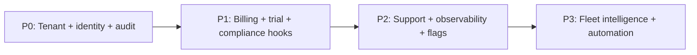

# NexusOps — Master Admin Console (MAC) Roadmap

A planning document for a fully functional **Master Admin Console (MAC)** operated by Coheron above all customer tenants. This file captures scope, domains, phases, and sequencing — not implementation status.

---

## 1. Purpose and principles

**MAC is the Coheron-operated control plane** above all customer tenants. It is not a second NexusOps instance for customers; it is how Coheron **creates, governs, observes, and supports** the fleet.

### Design principles

- **Least privilege:** Coheron operators get only what their role needs, for only as long as needed (time-bound elevation).
- **Tenant sovereignty:** Customer admins remain authoritative inside their org; MAC is an **exception path**, not daily operations.
- **Audit everything material:** Who did what, to which tenant, when, from where, with what approval.
- **Same product truth:** MAC reads/writes the same APIs and DB concepts as the tenant app (orgs, users, plans, flags) — avoid a parallel shadow model that drifts.
- **Modes of engagement:** Self-serve signup + MAC-assisted onboarding + enterprise contract should all be **billing and policy variants**, not three different architectures.

---

## 2. Personas and RBAC (inside MAC)

| Persona | Typical scope |
|--------|----------------|
| **Platform super-admin** | Full fleet (rare, break-glass). |
| **Provisioning / onboarding** | Create org, set plan/trial, invite first admin, template packs. |
| **Billing / revops** | Subscriptions, invoices, credits, tax profile, dunning. |
| **Support L1/L2** | Read-only tenant health, user lookup, impersonation (if allowed), ticket links. |
| **Security / compliance** | Abuse, incident response, data requests, retention, export. |
| **Product / engineering** | Feature flags, kill switches, maintenance windows, schema/migration visibility. |
| **Success / CSM** | Usage, adoption, health scores, playbook tasks (non-destructive). |

Each action maps to **MAC permissions** plus **approval workflows** for destructive or sensitive operations (delete tenant, bulk export, impersonation).

---

## 3. Roadmap phases (high level)

| Phase | Focus |
|-------|--------|
| **P0 — Viable MAC** | Create/manage orgs and first admin, operator auth, audit log, basic search. |
| **P1 — Commercial MAC** | Trials, subscriptions, payment state, legal acceptance tracking, dunning. |
| **P2 — Operational MAC** | Health, logs, support tooling, feature flags, safe impersonation, comms. |
| **P3 — Strategic MAC** | Analytics, automation, policy packs, abuse ML hooks, multi-region ops. |

---

## 4. Domain-by-domain backlog

### 4.1 Tenant lifecycle

- **Create org:** name, slug, region (future), plan, trial dates, billing mode (self-serve vs invoice).
- **Suspend / resume:** grace periods; read-only vs hard block; message to tenant admins.
- **Offboard / delete:** soft-delete retention, legal hold, irreversible delete after N days, backup/export requirements.
- **Merge / split orgs** (advanced): rare; only if enterprise demands — low priority.
- **Org metadata:** industry, segment, CSM owner, contract IDs, notes (internal-only).

### 4.2 Identity and access (MAC-side)

- **MAC operator SSO:** OIDC/SAML for corporate IdP; MFA enforced.
- **Service accounts / API keys** for MAC automation (with rotation, scopes).
- **Break-glass accounts** with extra logging and periodic access review.

### 4.3 Customer identity (tenant-side from MAC)

- **First admin invite** (primary MAC onboarding story).
- **Bulk invite** (CSV) for large rollouts — with validation and rate limits.
- **Password / session policy** templates per plan (session length, lockout) — aligns with tenant session model.
- **SSO for tenants** (SAML/OIDC): MAC enables enterprise pack, uploads metadata, tests connection.
- **SCIM** (optional later): directory sync from customer IdP.

### 4.4 RBAC and entitlements (NexusOps-specific)

NexusOps has a **large module matrix** (ITSM, HR, procurement, GRC, India compliance, etc.). MAC should own:

- **Plan → module entitlements** (which routers/features are on).
- **Seat limits** (named users vs concurrent — product decision).
- **Role templates** (“ITIL shop”, “HR-heavy”) applied at onboarding.
- **Kill switch per module** for incidents (disable walk-up, disable AI, etc.).

### 4.5 Billing and subscriptions

Aligned with intended model: **card on file to start trial**, then **paid subscription** after trial.

- **Products/prices** in MAC or synced from payment provider (single source of truth).
- **Trials:** start/end, extension, conversion, card required to start trial.
- **Subscriptions:** status, renewal, cancellation, proration rules (documented).
- **Invoices / credit notes** for enterprise.
- **Tax/VAT IDs, billing contacts**, PO numbers.
- **Dunning:** failed payment → notifications → suspend policy.
- **Usage-based hooks** (future): API calls, storage, seats — metering pipeline and MAC views.

### 4.6 Legal, privacy, trust

- **Terms / Privacy / EULA versioning**; which version each org and user accepted; re-accept flows.
- **DPA / subprocessors** list; region of data processing.
- **Cookie/consent** if marketing site + app share analytics (often separate from MAC but linked).
- **Data processing agreements** attachment per enterprise org.

### 4.7 Security and abuse

- **Tenant-level rate limits** overrides (support hotfix).
- **IP allowlist/blocklist** (enterprise).
- **Abuse detection:** mass signups, credential stuffing signals, spam org names.
- **Credential leak response:** force password reset, revoke all sessions for org or user.
- **API key management** (if exposing public API keys per org): revoke from MAC.

### 4.8 Data governance

NexusOps holds sensitive operational data.

- **Export:** per-tenant full export (for migration or legal) — scope, format, encryption, delivery.
- **Retention policies:** ticket/attachment retention by plan or regulation.
- **Legal hold:** freeze deletes.
- **Anonymization** tools for GDPR-style requests (where applicable — lawyer-driven).

### 4.9 Observability and reliability

- **Fleet health:** API error rates, queue depth, DB lag, Redis, by region (future).
- **Per-tenant health:** last login, failed logins, 4xx/5xx attributed to org (where possible).
- **Incident management:** status page integration, broadcast banner to all tenants or subset.
- **Maintenance windows:** scheduled read-only or degraded mode messaging.

### 4.10 Support tooling

- **Global user search** (by email) → list org memberships (with strict policy).
- **Read-only tenant context:** plan, entitlements, recent audit events (not arbitrary data dump unless approved).
- **Impersonation** (optional): time-boxed, reason-coded, **always** audited; optional tenant-visible banner (“Coheron support is viewing…”).
- **Case integration:** Jira/Linear link from MAC entity to internal ticket.

### 4.11 Product configuration

- **Feature flags** per org, per plan, or percentage rollout.
- **Configuration presets:** “demo org”, “pilot org”, “production enterprise”.
- **Content packs:** seed categories, SLA profiles, workflow stubs (aligned with shipped modules).
- **Announcement system:** in-app messages to selected tenants (downtime, new module).

### 4.12 NexusOps module-specific MAC hooks (envisioned)

| Area | MAC angle |
|------|-----------|
| **ITSM / tickets / SLAs** | Default SLA packs; emergency SLA recalculation job; disable portal. |
| **Assets / CMDB** | Optional seed classes; bulk import jobs supervised from MAC. |
| **HR / people** | Stronger audit; region lock (e.g. EU vs IN); feature gating for sensitive HR. |
| **Procurement / financial** | Entitlement for financial modules; fraud flags on unusual PO volume. |
| **GRC / security / legal** | Compliance tier flags; retention templates. |
| **India compliance** | Enable/disable pack; jurisdiction metadata on org. |
| **Walk-up / portal** | Toggle external-facing surfaces per org during abuse or maintenance. |
| **AI / virtual agent** | Global model/version, cost caps, disable AI for tenant. |
| **Integrations** | OAuth app credentials (Coheron-managed vs BYO); webhook replay. |

### 4.13 Communications

- **Email templates** for invite, trial ending, payment failed (MAC previews and versioning).
- **Webhook endpoints** for billing and lifecycle events to internal systems.

### 4.14 Developer / platform operations

- **Schema migration visibility:** app release vs migration status per environment.
- **Job queue dashboard:** failed background jobs per tenant (if queues exist).
- **Secrets rotation** checklist integration (link to runbooks; do not store raw secrets in MAC UI).

### 4.15 Analytics and growth (P3)

- **Funnel:** signup → activation events (first ticket, first user invite).
- **Churn risk scores:** login frequency, seat utilization, support tickets.
- **Cohort reports** by plan, region, vertical.

### 4.16 Automation and policy (P3)

- **Playbooks:** “New enterprise org” checklist (MAC tasks + Slack notifications).
- **Auto-suspend** after repeated payment failure + policy.
- **Quota enforcement** jobs driven from MAC config.

---

## 5. Non-functional requirements

- **Audit store:** append-only, queryable, exportable for audits.
- **Performance:** MAC is low-traffic but high-risk — optimize for correctness and traceability, not QPS.
- **Availability:** MAC failure should not take down tenant app; prefer read-only degradation.
- **Environments:** separate MAC for **prod / staging** with no cross-env actions.
- **Compliance targets:** SOC 2-style controls mapping (access reviews, change management) as the company matures.

---

## 6. Dependencies on NexusOps core

- Stable **`org_id`** as tenant key everywhere.
- **Server-side entitlements** enforced in API (MAC only toggles flags; tenants cannot bypass).
- **Webhooks or events** from billing provider → internal state → MAC display.
- **Consistent RBAC matrix** between product admin and MAC entitlements (avoid two permission models forever).

---

## 7. Suggested sequencing

1. **P0:** Org CRUD, first-admin invite, MAC operator auth, audit log, org search.
2. **P0.5:** Session revoke org-wide, suspend/resume, internal notes.
3. **P1:** Payment provider integration, trial + subscription state on org, legal acceptance version storage.
4. **P1.5:** Impersonation (if needed) with strict audit + time limit.
5. **P2:** Feature flags, health dashboards, support search, announcement banner.
6. **P3:** Analytics, automation, advanced governance.

---

## 8. Explicit out-of-scope (until proven need)

- Full **remote control** of tenant UIs beyond governed impersonation.
- **Arbitrary SQL** against tenant data from MAC UI.
- **MAC-built workflow designer** duplicating NexusOps workflows — use the product or governed scripts.

---

## 9. First concrete deliverable (when execution starts)

**P0 spine:** org + first admin + audit + MAC operator authentication. Everything else in this document hangs off that foundation.

---

*Document type: roadmap / planning. Legal and commercial copy (Terms, Privacy, trial language) must be reviewed by qualified counsel for target jurisdictions.*
