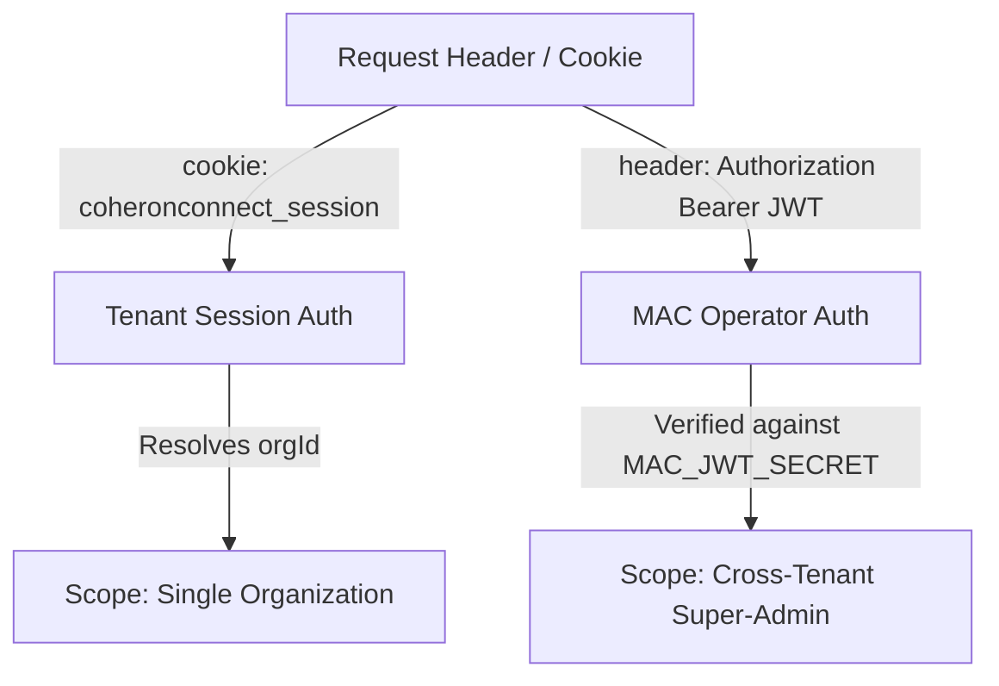

# Setup Wizard & Super-Admin Integration

This document outlines the architecture, data models, API endpoints, and authentication schemas of the **Setup Wizard** (onboarding flow) and how it integrates with the cross-tenant **Super-Admin (MAC)** API surface.

---

## 1. The Setup Wizard

### Steps & Purpose
The wizard consists of **7 steps** defined in [page.tsx](file:///c:/Users/jbbas/OneDrive/Desktop/CoheronConnect/apps/web/src/app/app/onboarding-wizard/page.tsx). They are categorized as follows:

| Step Number | Step Key | Step Label | Purpose | Type |
|-------------|----------|------------|---------|------|
| 1 | `welcome` | Welcome | Landing screen greeting users. | **Informational** |
| 2 | `org_profile` | Organisation | Collects basic business details. | **Data-bearing** |
| 3 | `india_setup` | India Setup | Collects tax, company, and compliance IDs. | **Data-bearing** |
| 4 | `team` | Invite Team | Prompts adding team members (links to settings). | **Informational** |
| 5 | `itsm` | ITSM Config | Configures default SLA response times. | **Data-bearing** |
| 6 | `finance` | Finance | Explains and executes Chart of Accounts seeding. | **Action-bearing** (optional seeds) |
| 7 | `done` | Done | Confirmation screen to exit wizard. | **Informational** |

---

### Fields & Validation Rules
Grounding references for all fields are in [page.tsx](file:///c:/Users/jbbas/OneDrive/Desktop/CoheronConnect/apps/web/src/app/app/onboarding-wizard/page.tsx) (UI validation) and [onboarding.ts](file:///c:/Users/jbbas/OneDrive/Desktop/CoheronConnect/apps/api/src/routers/onboarding.ts) (API schemas).

#### Step 2: Organisation Profile (`org_profile`)
- **Company Name (`displayName`)**:
  - Input Type: `text`
  - Validation: Non-empty string (`!data.displayName.trim()`).
  - Required: Yes
- **Industry (`industry`)**:
  - Input Type: `select`
  - Options: `Technology/SaaS`, `Manufacturing`, `Professional Services`, `Healthcare`, `Retail/E-commerce`, `Finance`, `Education`, `Real Estate`, `Other`.
  - Required: Yes
- **Company Size (`size`)**:
  - Input Type: `select`
  - Options: `1–10`, `11–50`, `51–200`, `201–500`, `500+`.
  - Required: Yes
- **City (`city`)**:
  - Input Type: `text`
  - Validation: Non-empty string (`!data.city.trim()`).
  - Required: Yes
- **State (`state`)**:
  - Input Type: `select`
  - Options: `Andhra Pradesh`, `Delhi`, `Gujarat`, `Karnataka`, `Kerala`, `Maharashtra`, `Rajasthan`, `Tamil Nadu`, `Telangana`, `Uttar Pradesh`, `West Bengal`, `Other`.
  - Required: Yes
- **Website (`website`)**:
  - Input Type: `text`
  - Validation: Non-empty string, matches URL regex in Zod backend schema (`z.string().url().or(z.string().min(1))`).
  - Required: Yes
- **Support Email (`supportEmail`)**:
  - Input Type: `email`
  - Validation: Non-empty string, must match Zod email parser (`z.string().email()`).
  - Required: Yes

#### Step 3: India Setup (`india_setup`)
- **GSTIN (`gstin`)**:
  - Input Type: `text` (auto uppercase)
  - Validation: Frontend `/^[A-Z0-9]{15}$/`, Backend Zod `/^[0-9A-Z]{15}$/`.
  - Required: Yes
- **PAN (`pan`)**:
  - Input Type: `text` (auto uppercase)
  - Validation: Frontend `/^[A-Z0-9]{10}$/`, Backend Zod `/^[A-Z]{5}[0-9]{4}[A-Z]{1}$/`.
  - Required: Yes
- **CIN (`cin`)**:
  - Input Type: `text` (auto uppercase)
  - Validation: Frontend `/^[A-Z0-9]{21}$/`, Backend Zod `/^[L|U]{1}[0-9]{5}[A-Z]{2}[0-9]{4}[A-Z]{3}[0-9]{6}$/`.
  - Required: Yes
- **TAN (TDS) (`tan`)**:
  - Input Type: `text` (auto uppercase)
  - Validation: Frontend `/^[A-Z0-9]{10}$/`, Backend Zod `/^[A-Z]{4}[0-9]{5}[A-Z]{1}$/`.
  - Required: Yes
- **EPF Establishment Code (`pf`)**:
  - Input Type: `text`
  - Validation: Non-empty (`data.pf.trim().length > 0`).
  - Required: Yes
- **Primary State Code (`stateCode`)**:
  - Input Type: `text` (auto uppercase)
  - Validation: Frontend `/^[A-Z0-9]{2}$/`, Backend Zod length of exactly 2.
  - Required: Yes
- **Seed India national holidays (`seedHolidays`)**:
  - Input Type: `checkbox` (default `true`)
  - Required: No (Optional action trigger)
- **Seed India standard Chart of Accounts (`seedCoa`)**:
  - Input Type: `checkbox` (default `true`)
  - Required: No (Optional action trigger)

#### Step 5: ITSM Config (`itsm`)
- **P1 — Critical (`sla.p1`)**:
  - Input Type: `number`
  - Validation: Positive integer >= 1.
  - Required: Yes
- **P2 — High (`sla.p2`)**:
  - Input Type: `number`
  - Validation: Positive integer >= 1.
  - Required: Yes
- **P3 — Medium (`sla.p3`)**:
  - Input Type: `number`
  - Validation: Positive integer >= 1.
  - Required: Yes
- **P4 — Low (`sla.p4`)**:
  - Input Type: `number`
  - Validation: Positive integer >= 1.
  - Required: Yes

---

## 2. Where the Data is Stored

The schema is defined in [auth.ts](file:///c:/Users/jbbas/OneDrive/Desktop/CoheronConnect/packages/db/src/schema/auth.ts) and [accounting.ts](file:///c:/Users/jbbas/OneDrive/Desktop/CoheronConnect/packages/db/src/schema/accounting.ts).

### Wizard Field to Database Mapping

| Wizard Form Field | Database Table | Database Column | Data Type | Nullability | Constraints |
|-------------------|----------------|-----------------|-----------|-------------|-------------|
| `displayName` | `organizations` | `name` | `text` | Not Null | None |
| `industry` | `organizations` | `industry` | `text` | Nullable | None |
| `size` | `organizations` | `company_size` | `text` | Nullable | None |
| `city` | `organizations` | `city` | `text` | Nullable | None |
| `state` | `organizations` | `state` | `text` | Nullable | None |
| `website` | `organizations` | `website` | `text` | Nullable | None |
| `supportEmail` | `organizations` | `support_email` | `text` | Nullable | None |
| `pan` | `organizations` | `pan` | `text` | Nullable | Raw value |
| `pan` (HMAC Hash) | `organizations` | `pan_masked_hash` | `text` | Nullable | Peppered HMAC |
| `pan` (Display) | `organizations` | `pan_masked_display` | `text` | Nullable | Masked string |
| `tan` | `organizations` | `tan` | `text` | Nullable | None |
| `pf` | `organizations` | `epf_code` | `text` | Nullable | None |
| `stateCode` | `organizations` | `primary_state_code` | `text` | Nullable | None |
| `gstin` | `gstin_registry` | `gstin` | `text` | Not Null | Unique |
| `cin` | `legal_entities` | `cin` | `text` | Nullable | None |
| `sla.p1` | `organizations` | `sla_p1_hours` | `integer` | Nullable | Positive int |
| `sla.p2` | `organizations` | `sla_p2_hours` | `integer` | Nullable | Positive int |
| `sla.p3` | `organizations` | `sla_p3_hours` | `integer` | Nullable | Positive int |
| `sla.p4` | `organizations` | `sla_p4_hours` | `integer` | Nullable | Positive int |

---

### Migrations
1. **[0031_workable_spot.sql](file:///c:/Users/jbbas/OneDrive/Desktop/CoheronConnect/packages/db/drizzle/0031_workable_spot.sql)**:
   - Added all primary setup wizard columns to the `organizations` table (`industry`, `company_size`, `city`, `state`, `website`, `support_email`, `pan`, `tan`, `epf_code`, `primary_state_code`, `sla_p1_hours`, `sla_p2_hours`, `sla_p3_hours`, `sla_p4_hours`).
   - Created the `super_admin_audit_logs` table.
   - Created the index `gstin_registry_gstin_idx`.
2. **[0037_optimal_vision.sql](file:///c:/Users/jbbas/OneDrive/Desktop/CoheronConnect/packages/db/drizzle/0037_optimal_vision.sql)**:
   - Added `pan_masked_hash` and `pan_masked_display` columns to the `organizations` table (for compliance with DPDP data minimization).

---

### Database Constraints
- **Uniqueness on GSTIN**: 
  Migration `0031` created `gstin_registry_gstin_idx` as a global `UNIQUE` constraint on the `gstin` column of `gstin_registry`.
  > [!WARNING]
  > This global unique constraint conflicts with the multi-tenant unique index `gstin_registry_org_gstin_idx` defined on `(org_id, gstin)` in [accounting.ts](file:///c:/Users/jbbas/OneDrive/Desktop/CoheronConnect/packages/db/src/schema/accounting.ts), which was meant to allow multiple orgs to independently register records.
- **Nullability**: All wizard-specific columns inside `organizations` are nullable at the database schema level (`notNull()` is omitted), meaning the database itself does not block partial saves.

---

## 3. The Save Path

### Mutation & Input Schema
The wizard invokes the tRPC mutation `trpc.onboarding.saveWizardData` defined in [onboarding.ts](file:///c:/Users/jbbas/OneDrive/Desktop/CoheronConnect/apps/api/src/routers/onboarding.ts).

**Nesting Schema**:
```typescript
export const saveWizardDataInputSchema = z.object({
  profile: z.object({
    displayName: z.string().min(1),
    industry: z.string().min(1),
    size: z.string().min(1),
    city: z.string().min(1),
    state: z.string().min(1),
    website: z.string().url().or(z.string().min(1)),
    supportEmail: z.string().email(),
  }).optional(),
  india: z.object({
    gstin: z.string().length(15).regex(/^[0-9A-Z]{15}$/),
    pan: z.string().length(10).regex(/^[A-Z]{5}[0-9]{4}[A-Z]{1}$/),
    cin: z.string().length(21).regex(/^[L|U]{1}[0-9]{5}[A-Z]{2}[0-9]{4}[A-Z]{3}[0-9]{6}$/),
    tan: z.string().length(10).regex(/^[A-Z]{4}[0-9]{5}[A-Z]{1}$/),
    pf: z.string().min(1),
    stateCode: z.string().length(2),
  }).optional(),
  itsm: z.object({
    p1: z.number().int().positive(),
    p2: z.number().int().positive(),
    p3: z.number().int().positive(),
    p4: z.number().int().positive(),
  }).optional()
});
```

### Save Trigger Frequency
Saves trigger **per-step** as the user completes each block of the form and clicks "Continue":
1. Completion of **Step 2** (`org_profile`) calls `saveWizardData` with `{ profile: orgData }`.
2. Completion of **Step 3** (`india_setup`) calls `saveWizardData` with `{ india: indiaData }`.
3. Completion of **Step 5** (`itsm`) calls `saveWizardData` with `{ itsm: sla }`.

---

### Re-entry Behavior
1. **Does it pre-fill?**
   **No**. The component states in [page.tsx](file:///c:/Users/jbbas/OneDrive/Desktop/CoheronConnect/apps/web/src/app/app/onboarding-wizard/page.tsx) are initialized as empty. There is no query fetch that retrieves existing onboarding settings from the database upon opening the wizard.
2. **Does it overwrite, merge or reject?**
   It **overwrites** existing values. When a step is submitted again, the mutation performs updates on the respective columns.
3. **Is there a "setup completed" flag?**
   **No**. There is no database column, status flag, or JSONB property that registers wizard completion.
4. **Is access gated once complete?**
   **No**. Access is never gated. The sidebar contains a direct link to `/app/onboarding-wizard` and the route does not perform redirection checks.

---

## 4. Auth Systems

There are **two distinct auth configurations** configured within the backend:



### Tenant User Auth
- **Endpoint**: `auth.login` / `auth.me` (defined in [auth.ts](file:///c:/Users/jbbas/OneDrive/Desktop/CoheronConnect/apps/api/src/routers/auth.ts)).
- **Mechanism**: Session-cookie tracking using the cookie `coheronconnect_session` (resolved in [trpc.ts](file:///c:/Users/jbbas/OneDrive/Desktop/CoheronConnect/apps/api/src/lib/trpc.ts)).
- **Scope**: Tied to a single tenant organization (`ctx.orgId` resolved from database).
- **Returned payload**: `{ user, org, sessionId }`.

### MAC Operator Auth (Super-Admin)
- **Endpoint**: `mac.login` (defined in [mac.ts](file:///c:/Users/jbbas/OneDrive/Desktop/CoheronConnect/apps/api/src/routers/mac.ts)).
- **Mechanism**: Validates credentials against `MAC_OPERATOR_EMAIL` and `MAC_OPERATOR_PASSWORD` environment variables. Issues a JWT signed using `MAC_JWT_SECRET`.
- **Token Location**: Sent in the `token` key in the response payload.
- **TTL**: 15 minutes (`expiresIn: "15m"`).
- **Scope**: Cross-tenant administrative control. The procedures require `Authorization: Bearer <token>`.

> [!IMPORTANT]
> The REST endpoints under `/api/super-admin/*` accept **only** the `mac_operator` bearer JWT. Standard tenant session cookies are completely rejected.

---

## 5. Super-Admin API

Grounding reference: [super-admin.ts](file:///c:/Users/jbbas/OneDrive/Desktop/CoheronConnect/apps/api/src/http/super-admin.ts).

### Endpoints Details

#### 1. `GET /api/super-admin/orgs`
- **Auth**: Bearer MAC JWT
- **Query Parameters**: `limit` (default 50), `offset` (default 0).
- **Response Shape**:
  ```json
  {
    "data": [
      {
        "id": "string (UUID)",
        "name": "string",
        "slug": "string",
        "plan": "string",
        "suspended": "boolean",
        "flagged": "boolean",
        "flagNote": "string | null",
        "profile": {
          "industry": "string | null",
          "companySize": "string | null",
          "city": "string | null",
          "state": "string | null",
          "website": "string | null",
          "supportEmail": "string | null"
        },
        "compliance": {
          "pan": "string | null",
          "tan": "string | null",
          "epfCode": "string | null",
          "primaryStateCode": "string | null",
          "gstin": "string | null",
          "cin": "string | null"
        },
        "itsm": {
          "slaP1Hours": "number | null",
          "slaP2Hours": "number | null",
          "slaP3Hours": "number | null",
          "slaP4Hours": "number | null"
        },
        "createdAt": "ISO String",
        "updatedAt": "ISO String"
      }
    ]
  }
  ```

#### 2. `GET /api/super-admin/orgs/:orgId`
- **Auth**: Bearer MAC JWT
- **Parameters**: `orgId` (UUID)
- **Response Shape**: `{ data: OrgRow }` (Same structure as single object inside `GET /orgs`).

#### 3. `PUT /api/super-admin/orgs/:orgId`
- **Auth**: Bearer MAC JWT
- **Request Body Shape**:
  ```json
  {
    "profile": {
      "industry": "string (optional)",
      "size": "string (optional)",
      "city": "string (optional)",
      "state": "string (optional)",
      "website": "string (optional)",
      "supportEmail": "string (optional)"
    },
    "india": {
      "gstin": "string (optional)",
      "pan": "string (optional)",
      "cin": "string (optional)",
      "tan": "string (optional)",
      "pf": "string (optional)",
      "stateCode": "string (optional)"
    },
    "itsm": {
      "p1": "number (optional)",
      "p2": "number (optional)",
      "p3": "number (optional)",
      "p4": "number (optional)"
    }
  }
  ```
- **Response Shape**: `{ ok: true, message: "Organization updated successfully" }`

#### 4. `POST /api/super-admin/orgs/:orgId/flag`
- **Auth**: Bearer MAC JWT
- **Request Body Shape**: `{ flagged: boolean, note?: string }`
- **Response Shape**: `{ ok: true, message: "Organization flag updated" }`

#### 5. `DELETE /api/super-admin/orgs/:orgId`
- **Auth**: Bearer MAC JWT
- **Response Shape**: `{ ok: true, message: "Organization suspended" }` (Updates `settings.suspended = true` on the organization settings JSONB).

---

### Mismatched Parameter Mappings (GET vs. PUT)
External client integrators must map the following mismatched parameter structures:

| Concept | GET Response Key path | PUT Request Key path |
|---------|-----------------------|----------------------|
| Company Size | `profile.companySize` | `profile.size` |
| EPF Code | `compliance.epfCode` | `india.pf` |
| State Code | `compliance.primaryStateCode` | `india.stateCode` |
| SLA P1 Hours | `itsm.slaP1Hours` | `itsm.p1` |
| SLA P2 Hours | `itsm.slaP2Hours` | `itsm.p2` |
| SLA P3 Hours | `itsm.slaP3Hours` | `itsm.p3` |
| SLA P4 Hours | `itsm.slaP4Hours` | `itsm.p4` |

*Additionally, `displayName` is accepted by Zod in the `PUT` payload but is completely ignored and **not** written to the database column `organizations.name` by the route handler.*

---

### Real Organization JSON Response (Dev environment test)
The following is an actual JSON body fetched from a localhost call to `/api/super-admin/orgs` (representing a setup-wizard-completed organization `Cyborg`):

```json
{
  "id": "443dd7ab-746b-4db6-b5c3-b864c0a55518",
  "name": "Cyborg",
  "slug": "cyborg",
  "plan": "free",
  "suspended": false,
  "flagged": false,
  "profile": {
    "industry": "Technology",
    "companySize": "100-500",
    "city": "San Francisco",
    "state": "CA",
    "website": "https://example.com",
    "supportEmail": "support@example.com"
  },
  "compliance": {
    "pan": "ABCDE1234F",
    "tan": "ABCD12345E",
    "epfCode": "MH/12345",
    "primaryStateCode": "22",
    "gstin": "22AAAAA0000A1Z5",
    "cin": "L12345MH2000PLC123456"
  },
  "itsm": {
    "slaP1Hours": 2,
    "slaP2Hours": 4,
    "slaP3Hours": 8,
    "slaP4Hours": 24
  },
  "createdAt": "2026-06-20T05:45:55.555Z",
  "updatedAt": "2026-07-15T09:42:16.260Z"
}
```

- **Verification Environment**: These routes have been verified working on **localhost**.
- **Production Verification**: **unverified**.

---

## 6. Audit Logging

### Audit Table & Schema
Grounding reference: [audit.ts](file:///c:/Users/jbbas/OneDrive/Desktop/CoheronConnect/packages/db/src/schema/audit.ts).
- Table name: `super_admin_audit_logs`
- Schema columns: `id`, `actor_email` (`actorEmail`), `org_id` (`orgId`), `action`, `before_json` (`beforeJson`), `after_json` (`afterJson`), `created_at` (`createdAt`).

### Write Trigger Events
Write records are inserted in [super-admin.ts](file:///c:/Users/jbbas/OneDrive/Desktop/CoheronConnect/apps/api/src/http/super-admin.ts) during these state changes:
- `UPDATE_WIZARD_DATA`: Logged during PUT `/orgs/:orgId`.
- `FLAG_ORG` / `UNFLAG_ORG`: Logged during POST `/orgs/:orgId/flag`.
- `SUSPEND_ORG`: Logged during DELETE `/orgs/:orgId`.

### Read Paths
- **None**. No client-facing endpoint, router, or administrator panel queries or returns data from `super_admin_audit_logs`. The table remains write-only in production.

---

## 7. CORS & Deployment

### Configuration Location
CORS rules are configured in [index.ts](file:///c:/Users/jbbas/OneDrive/Desktop/CoheronConnect/apps/api/src/index.ts).

### Allowed Origins
1. **Hardcoded origins**:
   - `https://coheronconnect-super-fwyz.bolt.host` (Bolt SPA client)
   - Matches regex `/\.bolt\.host$/` and `/\.bolt\.new$/` (Bolt previews/environments)
   - `https://bolt.new`
2. **Environment variable configuration**:
   - Parsed from `process.env.CORS_ORIGIN` (falls back to `process.env.NEXT_PUBLIC_APP_URL` if empty).
3. **Localhost**:
   - Matches regex `^https?:\/\/(localhost|127\.0\.0\.1)(:\d+)?$`. Localhost requests are allowed on all ports regardless of whether the environment is development or production.

### Live Environments
- **Localhost API**: `http://localhost:3001`
- **Production Frontend**: `https://connect.coheron.tech`
- **Production API URL**: **unverified**.

---

## Gaps

The following behaviors remain **unverified** or **unimplemented**:
1. **Completion Check logic**: There is no gate, redirection, or read logic to identify if the setup wizard has already been completed by an organization. An admin can visit `/app/onboarding-wizard` at any point and overwrite settings.
2. **REST API Test Coverage**: There are no automated integration test files validating the REST API endpoints under `/api/super-admin/*` (unlike the tRPC `mac` router tests in [mac-auth.test.ts](file:///c:/Users/jbbas/OneDrive/Desktop/CoheronConnect/apps/api/src/__tests__/mac-auth.test.ts)).
3. **Production URL verification**: The domain name/URL of the production REST API is undocumented and unverified.
4. **GSTIN Registry Index Constraint Clash**: There is an unresolved clash in migrations between the global unique index `gstin_registry_gstin_idx` on `gstin` and the tenant-scoped index `gstin_registry_org_gstin_idx`.
