# CoheronConnect — Data Model Reference

> Auto-derived from `packages/db/src/schema/*.ts`. Regenerate after schema changes.
> Last generated as part of Phase 2 (Data model to A), Deliverable 3.

## 1. Overview

CoheronConnect is a multi-tenant platform. Every row of business data belongs to exactly one organization (tenant). Tenancy is enforced in three ways:

1. **Direct tenancy** — the table carries an `org_id` column (FK → `organizations`, `ON DELETE CASCADE`).
2. **Inherited tenancy** — a child/detail table has no `org_id` but is reachable from a tenant-scoped parent via a `NOT NULL` FK (often `ON DELETE CASCADE`), so it is scoped transitively.
3. **Global anchors** — a small set of platform tables that are intentionally not tenant-scoped.

### Table inventory

| Class | Count | Meaning |
|---|---:|---|
| Direct tenant (`org_id`) | 157 | Scoped directly to one organization |
| Tenant via parent | 36 | Detail/child tables scoped through a parent FK |
| Global anchor | 6 | Platform-level, not tenant-scoped by design |
| **Total** | **199** | |

### Foreign-key deletion policy

After Phase 2 D2, **all 409 FK references carry an explicit `onDelete` rule** (no implicit `NO ACTION`).

| `onDelete` | Count | Used for |
|---|---:|---|
| `cascade` | 244 | `org_id` → organizations; child → owning parent |
| `set null` | 119 | Nullable actor refs (preserve record, clear link) |
| `restrict` | 31 | NOT NULL actor refs; lookup/reference rows (block orphaning) |

> Counts above are parsed from `uuid()`/`text()` FK declarations; the schema sweep reports 409 total references including multi-line forms.

## 2. Global anchor tables

These are intentionally not tenant-scoped. They sit above or beside the tenancy boundary.

| Table | Role |
|---|---|
| `accounts` | OAuth/credential provider links for a user (auth.js style). |
| `organizations` | The tenant root. Every tenant-scoped row chains back here. |
| `permissions` | Global catalogue of permission strings. |
| `role_permissions` | Global role → permission mapping. |
| `sessions` | Active login sessions. |
| `verification_tokens` | Email/verification one-time tokens. |

## 3. Tenant-via-parent tables

These detail tables have no `org_id`; they inherit tenant scope through the listed parent FK.

| Table | Inherits tenancy through |
|---|---|
| `agent_messages` | via conversationId → agent_conversations |
| `asset_history` | via assetId → assets |
| `change_approvals` | via changeId → change_requests |
| `ci_relationships` | via sourceId → ci_items |
| `contract_obligations` | via contractId → contracts |
| `document_acls` | via documentId → documents |
| `document_versions` | via documentId → documents |
| `grn_line_items` | via grnId → goods_receipt_notes |
| `hr_case_tasks` | via caseId → hr_cases |
| `integration_sync_logs` | via integrationId → integrations |
| `invoice_line_items` | via invoiceId → invoices |
| `kb_feedback` | via userId → users |
| `leave_balances` | via employeeId → employees |
| `license_assignments` | via licenseId → software_licenses |
| `notification_preferences` | via userId → users |
| `oncall_overrides` | via scheduleId → oncall_schedules |
| `po_line_items` | via poId → purchase_orders |
| `project_milestones` | via projectId → projects |
| `project_tasks` | via projectId → projects |
| `purchase_request_items` | via prId → purchase_requests |
| `room_bookings` | via roomId → rooms → buildings |
| `rooms` | via buildingId → buildings |
| `signature_audit` | via requestId → signature_requests |
| `signature_signers` | via requestId → signature_requests |
| `survey_responses` | via surveyId → surveys |
| `team_members` | via teamId → teams |
| `ticket_activity_logs` | via ticketId → tickets |
| `ticket_comments` | via ticketId → tickets |
| `ticket_relations` | via sourceId → tickets |
| `ticket_watchers` | via ticketId → tickets |
| `user_roles` | via roleId → roles |
| `webhook_deliveries` | via webhookId → webhooks |
| `work_order_activity_logs` | via workOrderId → work_orders |
| `workflow_runs` | via workflowId → workflows |
| `workflow_step_runs` | via runId → workflow_runs → workflows |
| `workflow_versions` | via workflowId → workflows |

## 4. Module dependency map (ERD, module level)

Arrows point from a module that holds a foreign key to the module it references (cross-module FKs only). Edge labels show the number of FK references.

```mermaid
flowchart LR
  issuer_programme["issuer-programme"] -->|24| auth["auth"]
  hr["hr"] -->|21| auth["auth"]
  tickets["tickets"] -->|15| auth["auth"]
  grc["grc"] -->|13| auth["auth"]
  recruitment["recruitment"] -->|13| auth["auth"]
  crm["crm"] -->|12| auth["auth"]
  procurement["procurement"] -->|12| auth["auth"]
  accounting["accounting"] -->|11| auth["auth"]
  secretarial["secretarial"] -->|11| auth["auth"]
  changes["changes"] -->|10| auth["auth"]
  facilities["facilities"] -->|8| auth["auth"]
  india_compliance["india-compliance"] -->|8| auth["auth"]
  assets["assets"] -->|7| auth["auth"]
  performance["performance"] -->|7| auth["auth"]
  portal["portal"] -->|7| auth["auth"]
  work_orders["work-orders"] -->|6| auth["auth"]
  documents["documents"] -->|5| auth["auth"]
  projects["projects"] -->|5| auth["auth"]
  security["security"] -->|5| auth["auth"]
  surveys["surveys"] -->|5| auth["auth"]
  catalog["catalog"] -->|4| auth["auth"]
  events["events"] -->|4| auth["auth"]
  expenses["expenses"] -->|4| auth["auth"]
  legal["legal"] -->|4| auth["auth"]
  assignment["assignment"] -->|3| auth["auth"]
  contracts["contracts"] -->|3| auth["auth"]
  csm["csm"] -->|3| auth["auth"]
  devops["devops"] -->|3| auth["auth"]
  esign["esign"] -->|3| auth["auth"]
  integrations["integrations"] -->|3| auth["auth"]
  inventory["inventory"] -->|3| auth["auth"]
  notifications["notifications"] -->|3| auth["auth"]
  agent["agent"] -->|2| auth["auth"]
  apm["apm"] -->|2| auth["auth"]
  approvals["approvals"] -->|2| auth["auth"]
  business_rules["business-rules"] -->|2| auth["auth"]
  csm["csm"] -->|2| crm["crm"]
  custom_fields["custom-fields"] -->|2| auth["auth"]
  financial["financial"] -->|2| auth["auth"]
  issuer_programme["issuer-programme"] -->|2| contracts["contracts"]
  issuer_programme["issuer-programme"] -->|2| security["security"]
  oncall["oncall"] -->|2| auth["auth"]
  portal["portal"] -->|2| tickets["tickets"]
  procurement["procurement"] -->|2| legal_entity["legal-entity"]
  workflows["workflows"] -->|2| auth["auth"]
  assignment["assignment"] -->|1| tickets["tickets"]
  events["events"] -->|1| tickets["tickets"]
  hr["hr"] -->|1| tickets["tickets"]
  issuer_programme["issuer-programme"] -->|1| legal["legal"]
  issuer_programme["issuer-programme"] -->|1| tickets["tickets"]
  knowledge["knowledge"] -->|1| auth["auth"]
  legal_entity["legal-entity"] -->|1| auth["auth"]
  portal["portal"] -->|1| legal["legal"]
  procurement["procurement"] -->|1| assets["assets"]
  surveys["surveys"] -->|1| tickets["tickets"]
```

## 5. Per-module table ownership

Each table's tenancy class and its outgoing foreign keys with deletion rules.

### `accounting`

| Table | Tenancy | Foreign keys (→ target, onDelete) |
|---|---|---|
| `bank_statements` | direct (`org_id`) | `orgId`→`organizations` (cascade) `accountId`→`chart_of_accounts` (restrict) `createdById`→`users` (set null) |
| `bank_transactions` | direct (`org_id`) | `orgId`→`organizations` (cascade) `statementId`→`bank_statements` (cascade) `matchedJournalEntryId`→`journal_entries` (set null) `matchedById`→`users` (set null) |
| `chart_of_accounts` | direct (`org_id`) | `orgId`→`organizations` (cascade) |
| `gstin_registry` | direct (`org_id`) | `orgId`→`organizations` (cascade) |
| `gstr_filings` | direct (`org_id`) | `orgId`→`organizations` (cascade) `gstinId`→`gstin_registry` (restrict) |
| `journal_entries` | direct (`org_id`) | `orgId`→`organizations` (cascade) `createdById`→`users` (set null) `postedById`→`users` (set null) |
| `journal_entry_lines` | direct (`org_id`) | `journalEntryId`→`journal_entries` (cascade) `orgId`→`organizations` (cascade) `accountId`→`chart_of_accounts` (restrict) |

### `agent`

| Table | Tenancy | Foreign keys (→ target, onDelete) |
|---|---|---|
| `agent_conversations` | direct (`org_id`) | `orgId`→`organizations` (cascade) `userId`→`users` (cascade) |
| `agent_messages` | via parent | `conversationId`→`agent_conversations` (cascade) |

### `apm`

| Table | Tenancy | Foreign keys (→ target, onDelete) |
|---|---|---|
| `applications` | direct (`org_id`) | `orgId`→`organizations` (cascade) `ownerId`→`users` (set null) |

### `approvals`

| Table | Tenancy | Foreign keys (→ target, onDelete) |
|---|---|---|
| `approval_steps` | direct (`org_id`) | `orgId`→`organizations` (cascade) `approverId`→`users` (restrict) |

### `assets`

| Table | Tenancy | Foreign keys (→ target, onDelete) |
|---|---|---|
| `asset_history` | via parent | `assetId`→`assets` (cascade) `actorId`→`users` (set null) |
| `asset_types` | direct (`org_id`) | `orgId`→`organizations` (cascade) |
| `assets` | direct (`org_id`) | `orgId`→`organizations` (cascade) `typeId`→`asset_types` (restrict) `ownerId`→`users` (set null) |
| `ci_items` | direct (`org_id`) | `orgId`→`organizations` (cascade) |
| `ci_relationships` | via parent | `sourceId`→`ci_items` (cascade) `targetId`→`ci_items` (cascade) |
| `license_assignments` | via parent | `licenseId`→`software_licenses` (cascade) `assetId`→`assets` (cascade) `userId`→`users` (cascade) |
| `software_licenses` | direct (`org_id`) | `orgId`→`organizations` (cascade) |

### `assignment`

| Table | Tenancy | Foreign keys (→ target, onDelete) |
|---|---|---|
| `assignment_rules` | direct (`org_id`) | `orgId`→`organizations` (cascade) `teamId`→`teams` (cascade) |
| `user_assignment_stats` | direct (`org_id`) | `orgId`→`organizations` (cascade) `userId`→`users` (cascade) |

### `auth`

| Table | Tenancy | Foreign keys (→ target, onDelete) |
|---|---|---|
| `accounts` | **global** | `userId`→`users` (cascade) |
| `api_keys` | direct (`org_id`) | `orgId`→`organizations` (cascade) `createdById`→`users` (restrict) |
| `audit_logs` | direct (`org_id`) | `orgId`→`organizations` (cascade) `userId`→`users` (set null) |
| `invites` | direct (`org_id`) | `orgId`→`organizations` (cascade) `invitedByUserId`→`users` (restrict) |
| `organizations` | **global** | — |
| `permissions` | **global** | — |
| `role_permissions` | **global** | `roleId`→`roles` (cascade) `permissionId`→`permissions` (cascade) |
| `roles` | direct (`org_id`) | `orgId`→`organizations` (cascade) |
| `sessions` | **global** | `userId`→`users` (cascade) |
| `user_roles` | via parent | `userId`→`users` (cascade) `roleId`→`roles` (cascade) |
| `users` | direct (`org_id`) | `orgId`→`organizations` (cascade) |
| `verification_tokens` | **global** | — |

### `business-rules`

| Table | Tenancy | Foreign keys (→ target, onDelete) |
|---|---|---|
| `business_rules` | direct (`org_id`) | `orgId`→`organizations` (cascade) `createdBy`→`users` (set null) |

### `catalog`

| Table | Tenancy | Foreign keys (→ target, onDelete) |
|---|---|---|
| `catalog_items` | direct (`org_id`) | `orgId`→`organizations` (cascade) |
| `catalog_requests` | direct (`org_id`) | `orgId`→`organizations` (cascade) `itemId`→`catalog_items` (cascade) `requesterId`→`users` (restrict) `fulfillerId`→`users` (set null) |

### `changes`

| Table | Tenancy | Foreign keys (→ target, onDelete) |
|---|---|---|
| `change_approvals` | via parent | `changeId`→`change_requests` (cascade) `approverId`→`users` (restrict) |
| `change_blackout_windows` | direct (`org_id`) | `orgId`→`organizations` (cascade) |
| `change_requests` | direct (`org_id`) | `orgId`→`organizations` (cascade) `requesterId`→`users` (restrict) `assigneeId`→`users` (set null) |
| `known_errors` | direct (`org_id`) | `orgId`→`organizations` (cascade) `problemId`→`problems` (set null) |
| `problems` | direct (`org_id`) | `orgId`→`organizations` (cascade) `assigneeId`→`users` (set null) |
| `releases` | direct (`org_id`) | `orgId`→`organizations` (cascade) `createdBy`→`users` (set null) |

### `contracts`

| Table | Tenancy | Foreign keys (→ target, onDelete) |
|---|---|---|
| `contract_obligations` | via parent | `contractId`→`contracts` (cascade) |
| `contracts` | direct (`org_id`) | `orgId`→`organizations` (cascade) `internalOwnerId`→`users` (set null) `legalOwnerId`→`users` (set null) |

### `counters`

| Table | Tenancy | Foreign keys (→ target, onDelete) |
|---|---|---|
| `org_counters` | direct (`org_id`) | — |

### `crm`

| Table | Tenancy | Foreign keys (→ target, onDelete) |
|---|---|---|
| `crm_accounts` | direct (`org_id`) | `orgId`→`organizations` (cascade) `ownerId`→`users` (set null) |
| `crm_activities` | direct (`org_id`) | `orgId`→`organizations` (cascade) `dealId`→`crm_deals` (cascade) `contactId`→`crm_contacts` (set null) `accountId`→`crm_accounts` (set null) `ownerId`→`users` (set null) |
| `crm_contacts` | direct (`org_id`) | `orgId`→`organizations` (cascade) `accountId`→`crm_accounts` (set null) |
| `crm_deals` | direct (`org_id`) | `orgId`→`organizations` (cascade) `accountId`→`crm_accounts` (set null) `contactId`→`crm_contacts` (set null) `ownerId`→`users` (set null) `wonApprovedBy`→`users` (set null) |
| `crm_leads` | direct (`org_id`) | `orgId`→`organizations` (cascade) `ownerId`→`users` (set null) `convertedDealId`→`crm_deals` (set null) |
| `crm_pipeline_stages` | direct (`org_id`) | `orgId`→`organizations` (cascade) |
| `crm_quotes` | direct (`org_id`) | `orgId`→`organizations` (cascade) `dealId`→`crm_deals` (cascade) |

### `csm`

| Table | Tenancy | Foreign keys (→ target, onDelete) |
|---|---|---|
| `csm_cases` | direct (`org_id`) | `orgId`→`organizations` (cascade) `accountId`→`crm_accounts` (set null) `contactId`→`crm_contacts` (set null) `requesterId`→`users` (set null) `assigneeId`→`users` (set null) |

### `custom-fields`

| Table | Tenancy | Foreign keys (→ target, onDelete) |
|---|---|---|
| `custom_field_definitions` | direct (`org_id`) | `orgId`→`organizations` (cascade) |
| `custom_field_values` | direct (`org_id`) | `orgId`→`organizations` (cascade) `fieldId`→`custom_field_definitions` (cascade) |

### `devops`

| Table | Tenancy | Foreign keys (→ target, onDelete) |
|---|---|---|
| `deployments` | direct (`org_id`) | `orgId`→`organizations` (cascade) `pipelineRunId`→`pipeline_runs` (set null) `deployedById`→`users` (set null) |
| `pipeline_runs` | direct (`org_id`) | `orgId`→`organizations` (cascade) |

### `documents`

| Table | Tenancy | Foreign keys (→ target, onDelete) |
|---|---|---|
| `document_acls` | via parent | `documentId`→`documents` (cascade) `grantedById`→`users` (set null) |
| `document_retention_policies` | direct (`org_id`) | `orgId`→`organizations` (cascade) |
| `document_versions` | via parent | `documentId`→`documents` (cascade) `uploadedById`→`users` (set null) |
| `documents` | direct (`org_id`) | `orgId`→`organizations` (cascade) `ownerId`→`users` (set null) |

### `esign`

| Table | Tenancy | Foreign keys (→ target, onDelete) |
|---|---|---|
| `signature_audit` | via parent | `requestId`→`signature_requests` (cascade) `signerId`→`signature_signers` (set null) |
| `signature_requests` | direct (`org_id`) | `orgId`→`organizations` (cascade) `requestedById`→`users` (set null) |
| `signature_signers` | via parent | `requestId`→`signature_requests` (cascade) `internalUserId`→`users` (set null) |

### `events`

| Table | Tenancy | Foreign keys (→ target, onDelete) |
|---|---|---|
| `itom_correlation_policies` | direct (`org_id`) | `orgId`→`organizations` (cascade) |
| `itom_events` | direct (`org_id`) | `orgId`→`organizations` (cascade) `linkedIncidentId`→`tickets` (set null) |
| `itom_suppression_rules` | direct (`org_id`) | `orgId`→`organizations` (cascade) `createdBy`→`users` (set null) |

### `expenses`

| Table | Tenancy | Foreign keys (→ target, onDelete) |
|---|---|---|
| `expense_items` | direct (`org_id`) | `orgId`→`organizations` (cascade) `reportId`→`expense_reports` (cascade) |
| `expense_reports` | direct (`org_id`) | `orgId`→`organizations` (cascade) `submittedById`→`users` (restrict) `approverId`→`users` (set null) |

### `facilities`

| Table | Tenancy | Foreign keys (→ target, onDelete) |
|---|---|---|
| `buildings` | direct (`org_id`) | `orgId`→`organizations` (cascade) |
| `facility_requests` | direct (`org_id`) | `orgId`→`organizations` (cascade) `requesterId`→`users` (restrict) `assigneeId`→`users` (set null) |
| `move_requests` | direct (`org_id`) | `orgId`→`organizations` (cascade) `requesterId`→`users` (restrict) `approvedById`→`users` (set null) |
| `room_bookings` | via parent | `roomId`→`rooms` (cascade) `bookedById`→`users` (restrict) |
| `rooms` | via parent | `buildingId`→`buildings` (cascade) |

### `financial`

| Table | Tenancy | Foreign keys (→ target, onDelete) |
|---|---|---|
| `budget_lines` | direct (`org_id`) | `orgId`→`organizations` (cascade) |
| `chargebacks` | direct (`org_id`) | `orgId`→`organizations` (cascade) |

### `grc`

| Table | Tenancy | Foreign keys (→ target, onDelete) |
|---|---|---|
| `audit_findings` | direct (`org_id`) | `orgId`→`organizations` (cascade) `auditPlanId`→`audit_plans` (cascade) `actionOwnerId`→`users` (set null) `linkedRiskId`→`risks` (set null) |
| `audit_plans` | direct (`org_id`) | `orgId`→`organizations` (cascade) `auditorId`→`users` (set null) |
| `policies` | direct (`org_id`) | `orgId`→`organizations` (cascade) `ownerId`→`users` (set null) |
| `risk_control_evidence` | direct (`org_id`) | `orgId`→`organizations` (cascade) `controlId`→`risk_controls` (cascade) `createdBy`→`users` (set null) |
| `risk_controls` | direct (`org_id`) | `orgId`→`organizations` (cascade) `controlOwnerId`→`users` (set null) |
| `risks` | direct (`org_id`) | `orgId`→`organizations` (cascade) `ownerId`→`users` (set null) |
| `vendor_risks` | direct (`org_id`) | `orgId`→`organizations` (cascade) |

### `hr`

| Table | Tenancy | Foreign keys (→ target, onDelete) |
|---|---|---|
| `attendance_records` | direct (`org_id`) | `orgId`→`organizations` (cascade) `employeeId`→`employees` (cascade) |
| `employees` | direct (`org_id`) | `orgId`→`organizations` (cascade) `userId`→`users` (cascade) `salaryStructureId`→`salary_structures` (set null) |
| `expense_claims` | direct (`org_id`) | `orgId`→`organizations` (cascade) `employeeId`→`employees` (cascade) `approvedById`→`users` (set null) |
| `hr_case_tasks` | via parent | `caseId`→`hr_cases` (cascade) `assigneeId`→`users` (set null) |
| `hr_cases` | direct (`org_id`) | `orgId`→`organizations` (cascade) `employeeId`→`employees` (cascade) `statusId`→`ticket_statuses` (restrict) `assigneeId`→`users` (set null) |
| `leave_balances` | via parent | `employeeId`→`employees` (cascade) |
| `leave_requests` | direct (`org_id`) | `orgId`→`organizations` (cascade) `employeeId`→`employees` (cascade) `approvedById`→`users` (set null) |
| `okr_key_results` | direct (`org_id`) | `objectiveId`→`okr_objectives` (cascade) `orgId`→`organizations` (cascade) |
| `okr_objectives` | direct (`org_id`) | `orgId`→`organizations` (cascade) `ownerId`→`users` (cascade) |
| `onboarding_templates` | direct (`org_id`) | `orgId`→`organizations` (cascade) |
| `payroll_runs` | direct (`org_id`) | `orgId`→`organizations` (cascade) `approvedByHrId`→`users` (set null) `approvedByFinanceId`→`users` (set null) `approvedByCfoId`→`users` (set null) |
| `payslips` | direct (`org_id`) | `orgId`→`organizations` (cascade) `employeeId`→`employees` (cascade) `payrollRunId`→`payroll_runs` (cascade) |
| `public_holidays` | direct (`org_id`) | `orgId`→`organizations` (cascade) |
| `salary_structures` | direct (`org_id`) | `orgId`→`organizations` (cascade) |

### `india-compliance`

| Table | Tenancy | Foreign keys (→ target, onDelete) |
|---|---|---|
| `compliance_calendar_items` | direct (`org_id`) | `orgId`→`organizations` (cascade) `assignedToId`→`users` (set null) |
| `directors` | direct (`org_id`) | `orgId`→`organizations` (cascade) |
| `epfo_ecr_submissions` | direct (`org_id`) | `orgId`→`organizations` (cascade) |
| `portal_audit_log` | direct (`org_id`) | `orgId`→`organizations` (cascade) `portalUserId`→`portal_users` (set null) |
| `portal_users` | direct (`org_id`) | `orgId`→`organizations` (cascade) `createdByEmployeeId`→`users` (set null) |
| `tds_challan_records` | direct (`org_id`) | `orgId`→`organizations` (cascade) |

### `integrations`

| Table | Tenancy | Foreign keys (→ target, onDelete) |
|---|---|---|
| `ai_usage_logs` | direct (`org_id`) | `orgId`→`organizations` (cascade) |
| `integration_sync_logs` | via parent | `integrationId`→`integrations` (cascade) |
| `integrations` | direct (`org_id`) | `orgId`→`organizations` (cascade) |
| `webhook_deliveries` | via parent | `webhookId`→`webhooks` (cascade) |
| `webhooks` | direct (`org_id`) | `orgId`→`organizations` (cascade) |

### `inventory`

| Table | Tenancy | Foreign keys (→ target, onDelete) |
|---|---|---|
| `inventory_items` | direct (`org_id`) | `orgId`→`organizations` (cascade) |
| `inventory_transactions` | direct (`org_id`) | `orgId`→`organizations` (cascade) `itemId`→`inventory_items` (cascade) |
| `reorder_policies` | direct (`org_id`) | `orgId`→`organizations` (cascade) `itemId`→`inventory_items` (cascade) |

### `issuer-programme`

| Table | Tenancy | Foreign keys (→ target, onDelete) |
|---|---|---|
| `cci_combination_filings` | direct (`org_id`) | `orgId`→`organizations` (cascade) |
| `contract_clause_templates` | direct (`org_id`) | `orgId`→`organizations` (cascade) |
| `contract_esign_events` | direct (`org_id`) | `orgId`→`organizations` (cascade) `contractId`→`contracts` (cascade) |
| `director_interest_disclosures` | direct (`org_id`) | `orgId`→`organizations` (cascade) |
| `dpdp_processing_activities` | direct (`org_id`) | `orgId`→`organizations` (cascade) |
| `fema_return_records` | direct (`org_id`) | `orgId`→`organizations` (cascade) |
| `issuer_programme_matrix` | direct (`org_id`) | `orgId`→`organizations` (cascade) |
| `legal_hold_records` | direct (`org_id`) | `orgId`→`organizations` (cascade) `matterId`→`legal_matters` (set null) `contractId`→`contracts` (set null) |
| `lodor_calendar_entries` | direct (`org_id`) | `orgId`→`organizations` (cascade) |
| `mca_filing_records` | direct (`org_id`) | `orgId`→`organizations` (cascade) |
| `msme_payment_trackers` | direct (`org_id`) | `orgId`→`organizations` (cascade) |
| `privacy_breach_notification_profiles` | direct (`org_id`) | `orgId`→`organizations` (cascade) |
| `related_party_transactions` | direct (`org_id`) | `orgId`→`organizations` (cascade) |
| `resource_read_audit_events` | direct (`org_id`) | `orgId`→`organizations` (cascade) `userId`→`users` (cascade) |
| `sec_incident_ticket_links` | direct (`org_id`) | `orgId`→`organizations` (cascade) `incidentId`→`security_incidents` (cascade) `ticketId`→`tickets` (cascade) |
| `sector_regulator_licences` | direct (`org_id`) | `orgId`→`organizations` (cascade) |
| `shareholder_grievances` | direct (`org_id`) | `orgId`→`organizations` (cascade) |
| `shareholder_voting_results` | direct (`org_id`) | `orgId`→`organizations` (cascade) |
| `statutory_register_entries` | direct (`org_id`) | `orgId`→`organizations` (cascade) |
| `vulnerability_exceptions` | direct (`org_id`) | `orgId`→`organizations` (cascade) `vulnerabilityId`→`vulnerabilities` (cascade) `approvedBy`→`users` (set null) |
| `whistleblower_program_settings` | direct (`org_id`) | `orgId`→`organizations` (cascade) |
| `xbrl_export_jobs` | direct (`org_id`) | `orgId`→`organizations` (cascade) |

### `knowledge`

| Table | Tenancy | Foreign keys (→ target, onDelete) |
|---|---|---|
| `kb_feedback` | via parent | `userId`→`users` (set null) |

### `legal-entity`

| Table | Tenancy | Foreign keys (→ target, onDelete) |
|---|---|---|
| `legal_entities` | direct (`org_id`) | `orgId`→`organizations` (cascade) |

### `legal`

| Table | Tenancy | Foreign keys (→ target, onDelete) |
|---|---|---|
| `investigations` | direct (`org_id`) | `orgId`→`organizations` (cascade) |
| `legal_matters` | direct (`org_id`) | `orgId`→`organizations` (cascade) |
| `legal_requests` | direct (`org_id`) | `orgId`→`organizations` (cascade) `requesterId`→`users` (restrict) |

### `notifications`

| Table | Tenancy | Foreign keys (→ target, onDelete) |
|---|---|---|
| `notification_preferences` | via parent | `userId`→`users` (cascade) |
| `notifications` | direct (`org_id`) | `orgId`→`organizations` (cascade) `userId`→`users` (cascade) |

### `oncall`

| Table | Tenancy | Foreign keys (→ target, onDelete) |
|---|---|---|
| `oncall_overrides` | via parent | `scheduleId`→`oncall_schedules` (cascade) `userId`→`users` (restrict) |
| `oncall_schedules` | direct (`org_id`) | `orgId`→`organizations` (cascade) |

### `performance`

| Table | Tenancy | Foreign keys (→ target, onDelete) |
|---|---|---|
| `goals` | direct (`org_id`) | `orgId`→`organizations` (cascade) `cycleId`→`review_cycles` (set null) `ownerId`→`users` (restrict) |
| `performance_reviews` | direct (`org_id`) | `orgId`→`organizations` (cascade) `cycleId`→`review_cycles` (cascade) `revieweeId`→`users` (restrict) `reviewerId`→`users` (set null) |
| `review_cycles` | direct (`org_id`) | `orgId`→`organizations` (cascade) `createdById`→`users` (set null) |

### `portal`

| Table | Tenancy | Foreign keys (→ target, onDelete) |
|---|---|---|
| `announcements` | direct (`org_id`) | `orgId`→`organizations` (cascade) `authorId`→`users` (restrict) |
| `kb_article_revisions` | direct (`org_id`) | `articleId`→`kb_articles` (cascade) `orgId`→`organizations` (cascade) `createdBy`→`users` (set null) |
| `kb_articles` | direct (`org_id`) | `orgId`→`organizations` (cascade) `categoryId`→`ticket_categories` (set null) `matterId`→`legal_matters` (set null) `authorId`→`users` (restrict) |
| `request_templates` | direct (`org_id`) | `orgId`→`organizations` (cascade) `categoryId`→`ticket_categories` (set null) |

### `procurement`

| Table | Tenancy | Foreign keys (→ target, onDelete) |
|---|---|---|
| `approval_chains` | direct (`org_id`) | `orgId`→`organizations` (cascade) |
| `approval_requests` | direct (`org_id`) | `orgId`→`organizations` (cascade) `approverId`→`users` (restrict) `requesterId`→`users` (set null) |
| `goods_receipt_notes` | direct (`org_id`) | `orgId`→`organizations` (cascade) `poId`→`purchase_orders` (restrict) `receivedById`→`users` (set null) |
| `grn_line_items` | via parent | `grnId`→`goods_receipt_notes` (cascade) `poLineItemId`→`po_line_items` (set null) |
| `invoice_line_items` | via parent | `invoiceId`→`invoices` (cascade) |
| `invoices` | direct (`org_id`) | `orgId`→`organizations` (cascade) `vendorId`→`vendors` (restrict) `legalEntityId`→`legal_entities` (set null) `poId`→`purchase_orders` (set null) `grnId`→`goods_receipt_notes` (set null) `approvedById`→`users` (set null) |
| `po_line_items` | via parent | `poId`→`purchase_orders` (cascade) |
| `purchase_orders` | direct (`org_id`) | `orgId`→`organizations` (cascade) `prId`→`purchase_requests` (set null) `vendorId`→`vendors` (restrict) `legalEntityId`→`legal_entities` (set null) |
| `purchase_request_items` | via parent | `prId`→`purchase_requests` (cascade) `vendorId`→`vendors` (set null) `assetTypeId`→`asset_types` (set null) |
| `purchase_requests` | direct (`org_id`) | `orgId`→`organizations` (cascade) `requesterId`→`users` (restrict) |
| `vendors` | direct (`org_id`) | `orgId`→`organizations` (cascade) |

### `projects`

| Table | Tenancy | Foreign keys (→ target, onDelete) |
|---|---|---|
| `project_dependencies` | direct (`org_id`) | `orgId`→`organizations` (cascade) `fromProjectId`→`projects` (cascade) `toProjectId`→`projects` (cascade) |
| `project_milestones` | via parent | `projectId`→`projects` (cascade) |
| `project_tasks` | via parent | `projectId`→`projects` (cascade) `milestoneId`→`project_milestones` (set null) `assigneeId`→`users` (set null) |
| `projects` | direct (`org_id`) | `orgId`→`organizations` (cascade) `ownerId`→`users` (set null) |
| `strategic_initiatives` | direct (`org_id`) | `orgId`→`organizations` (cascade) |

### `recruitment`

| Table | Tenancy | Foreign keys (→ target, onDelete) |
|---|---|---|
| `candidate_applications` | direct (`org_id`) | `orgId`→`organizations` (cascade) `candidateId`→`candidates` (cascade) `jobId`→`job_requisitions` (cascade) `assignedTo`→`users` (set null) |
| `candidates` | direct (`org_id`) | `orgId`→`organizations` (cascade) `referredBy`→`users` (set null) |
| `interviews` | direct (`org_id`) | `orgId`→`organizations` (cascade) `applicationId`→`candidate_applications` (cascade) `createdBy`→`users` (set null) |
| `job_offers` | direct (`org_id`) | `orgId`→`organizations` (cascade) `applicationId`→`candidate_applications` (cascade) `candidateId`→`candidates` (cascade) `createdBy`→`users` (set null) |
| `job_requisitions` | direct (`org_id`) | `orgId`→`organizations` (cascade) `hiringManagerId`→`users` (set null) `recruiterId`→`users` (set null) `approverId`→`users` (set null) `createdBy`→`users` (set null) |

### `secretarial`

| Table | Tenancy | Foreign keys (→ target, onDelete) |
|---|---|---|
| `board_meetings` | direct (`org_id`) | `orgId`→`organizations` (cascade) `chairperson`→`users` (set null) `createdBy`→`users` (set null) |
| `board_resolutions` | direct (`org_id`) | `orgId`→`organizations` (cascade) `meetingId`→`board_meetings` (cascade) `createdBy`→`users` (set null) |
| `company_directors` | direct (`org_id`) | `orgId`→`organizations` (cascade) |
| `esop_grants` | direct (`org_id`) | `orgId`→`organizations` (cascade) `employeeId`→`users` (set null) |
| `secretarial_filings` | direct (`org_id`) | `orgId`→`organizations` (cascade) `assignedTo`→`users` (set null) |
| `share_capital` | direct (`org_id`) | `orgId`→`organizations` (cascade) |

### `security`

| Table | Tenancy | Foreign keys (→ target, onDelete) |
|---|---|---|
| `security_incidents` | direct (`org_id`) | `orgId`→`organizations` (cascade) `assigneeId`→`users` (set null) `reporterId`→`users` (set null) |
| `vulnerabilities` | direct (`org_id`) | `orgId`→`organizations` (cascade) `assigneeId`→`users` (set null) |

### `surveys`

| Table | Tenancy | Foreign keys (→ target, onDelete) |
|---|---|---|
| `survey_invites` | direct (`org_id`) | `orgId`→`organizations` (cascade) `surveyId`→`surveys` (cascade) `ticketId`→`tickets` (set null) `requesterId`→`users` (set null) |
| `survey_responses` | via parent | `surveyId`→`surveys` (cascade) `respondentId`→`users` (set null) |
| `surveys` | direct (`org_id`) | `orgId`→`organizations` (cascade) `createdById`→`users` (set null) |

### `tickets`

| Table | Tenancy | Foreign keys (→ target, onDelete) |
|---|---|---|
| `sla_policies` | direct (`org_id`) | `orgId`→`organizations` (cascade) |
| `team_members` | via parent | `teamId`→`teams` (cascade) `userId`→`users` (cascade) |
| `teams` | direct (`org_id`) | `orgId`→`organizations` (cascade) |
| `ticket_activity_logs` | via parent | `ticketId`→`tickets` (cascade) `userId`→`users` (set null) |
| `ticket_categories` | direct (`org_id`) | `orgId`→`organizations` (cascade) |
| `ticket_comments` | via parent | `ticketId`→`tickets` (cascade) `authorId`→`users` (restrict) |
| `ticket_handoffs` | direct (`org_id`) | `orgId`→`organizations` (cascade) `ticketId`→`tickets` (cascade) `fromAssigneeId`→`users` (set null) `toAssigneeId`→`users` (set null) |
| `ticket_priorities` | direct (`org_id`) | `orgId`→`organizations` (cascade) |
| `ticket_relations` | via parent | `sourceId`→`tickets` (cascade) `targetId`→`tickets` (cascade) |
| `ticket_statuses` | direct (`org_id`) | `orgId`→`organizations` (cascade) |
| `ticket_watchers` | via parent | `ticketId`→`tickets` (cascade) `userId`→`users` (cascade) |
| `tickets` | direct (`org_id`) | `orgId`→`organizations` (cascade) `categoryId`→`ticket_categories` (set null) `priorityId`→`ticket_priorities` (set null) `statusId`→`ticket_statuses` (restrict) `requesterId`→`users` (restrict) `assigneeId`→`users` (set null) `teamId`→`teams` (set null) |

### `work-orders`

| Table | Tenancy | Foreign keys (→ target, onDelete) |
|---|---|---|
| `work_order_activity_logs` | via parent | `workOrderId`→`work_orders` (cascade) `userId`→`users` (set null) |
| `work_order_tasks` | direct (`org_id`) | `workOrderId`→`work_orders` (cascade) `orgId`→`organizations` (cascade) `assignedToId`→`users` (set null) |
| `work_orders` | direct (`org_id`) | `orgId`→`organizations` (cascade) `assignedToId`→`users` (set null) `requestedById`→`users` (set null) |

### `workflows`

| Table | Tenancy | Foreign keys (→ target, onDelete) |
|---|---|---|
| `workflow_runs` | via parent | `workflowId`→`workflows` (cascade) `workflowVersionId`→`workflow_versions` (restrict) |
| `workflow_step_runs` | via parent | `runId`→`workflow_runs` (cascade) |
| `workflow_versions` | via parent | `workflowId`→`workflows` (cascade) |
| `workflows` | direct (`org_id`) | `orgId`→`organizations` (cascade) `createdById`→`users` (restrict) |

## 6. Regeneration

This document is generated from schema source. To refresh after schema changes, re-run the Phase 2 D3 generator against `packages/db/src/schema`.
